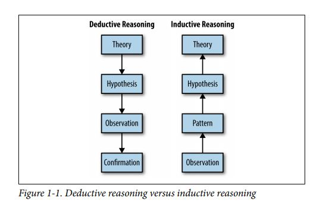
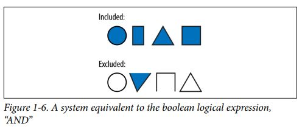
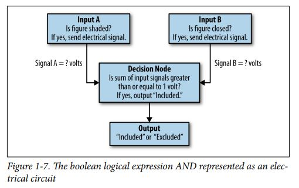
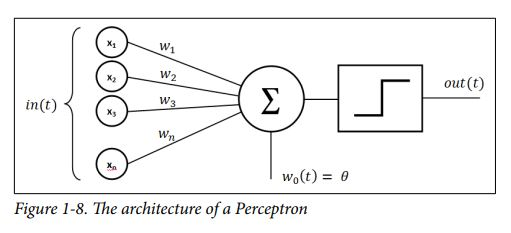
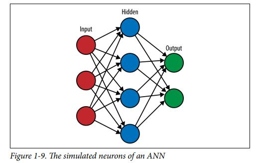
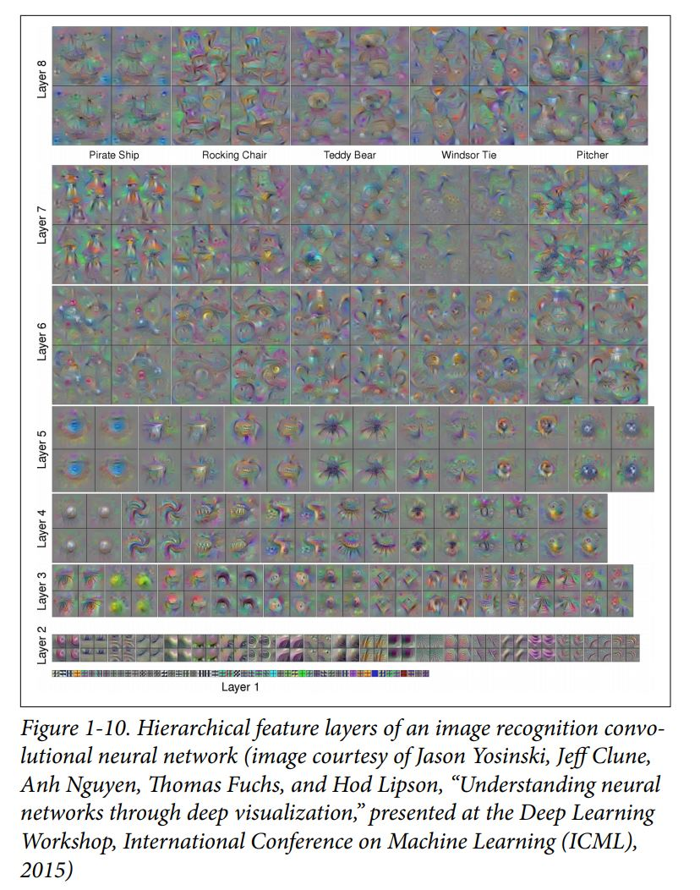

# Machine Learning for Designers

## Introduction

Belangrijkere banden tussen ontwerpers en developers zijn nodig voor het verwerkelijken van de toekomstige AI consumenten producten. In de komende onderdelen worden technische eigenschappen en tekorten van _machine learning_ behandeld en wat de implicaties hiervan zullen zijn voor user-facing designs. 

## Why Design for Machine Learning is Different

### A different kind of logic

Mensen maken gebruik van _fuzzy logic_. Statements die erg context afhankelijk zijn. Om hier iets nuttigs van te maken is er kennis nodig over een groot aantal mogelijkheden in grootte. 

* Die auto is heel klein, heel anders dan Pluto is een klein planeet.

Computers denken dus op binaire wijze. Benaderingen van fuzzy logic worden benaderd door een set van booleans. Machine learning verandert dit door een mechanisme te creëren waarmee computers experimentele kennis kunnen opdoen. Dus een groot bereik aan mogelijkheden kunnen ervaren. 

### A different kind of development

In traditionele programmeer settings gebruiken developers boolean logica om te verklaren in welke state een programma staat en hoe de gebruiker tussen die states kan navigeren. 

Een machine learning systeem zoekt voor patronen binnen een set herhaling met behulp van expliciet aangegeven regels hiervoor. Dit doet het systeem op een benadering te creëren van de regels die zijn gegeven om te leren. Door dus te experimenteren komt een machine learning systeem achter patronen en relaties tussen fysieke eigenschappen en het gedrag van objecten, dit doen kinderen ook op jonge leeftijd.

Mensen creëren hiervoor heuristieken. Sets van regels die altijd gelden zijn \(bijna altijd\), dat bespaart ons denkwerk. Machine learning benadert deze heuristieken door een netwerk van mogelijke relaties te creëren binnen een set samenhangende componenten in een complex systeem. 

Een machine learning systeem heeft een groot hoeveelheid voorbeelden nodig om een sterke waarschijnlijkheid in relaties te maken. 

> . Or, as the educational philosopher Patricia Carini said, “To let meaning occur requires time and the possibility for the rich and varied rela‐ tionships among things to become evident

### A different kind of precision

In conventionele programma's verwachten we dat het systeem op een voorspelbare manier handelt, keer op keer. Als binnen een dergelijk systeem  `2 + 2` wordt uitgevoerd, verwachten we dat de uitkomst _altijd_ 4 is. Bugs kunnen voorkomen, maar dit is niet waar vanuit wordt gegaan. Daarom worden er voor grote programma's vaak veel testen gedaan naar verschillende facetten ervan. 

> So, putting rare bugs aside, conventional programming languages can be thought of as systems that are always correct about mundane things like concrete mathematical operations.

> Machine learning algorithms, on the other hand, can be thought of as systems that are often correct about more complicated things like identifying human faces in an image.

Een inherente eigenschap van machine learning systemen is dat ze een benadering vormen voor complexere problemen aan de hand van gedrag dat het systeem geanalyseerd heeft. Hierdoor is een samenhangende eigenschap dat machine learning systemen zich soms onvoorspelbaar gedragen.  Machine learning systemen zijn dus niet perfect precies. 

### A different kind of problem

Machine learning systemen moeten gebruikt worden wanneer conventionele systemen geen oplossing bieden voor het probleem. In een setting waarbij een machine learning systeem geschikt is, komen een aantal kritische punten bij kijken. 

* Welke learning mechaniek gebruikt moet worden?
* Hoe wordt de data gecureerd die wordt aangeboden aan het systeem?

Het gebruik van machine learning systemen is gepast voor problemen die niet formeel beschreven kunnen worden in tekst, maar wel gebonden kunnen worden aan een groep voorbeelden. 

## What Is Machine Learning?

### The mental process of recognizing objects

> There are infinite combinations of properties that would yield the valid identification of a human face and an equally great number of combinations that would not. The set of rules separating these two groups is just too complex to describe through conditional logic. We are able to identify a face almost automatically because our great wealth of experience in observing and interacting with the visible world has allowed us to build up a set of heuristics that can be used to quickly, intuitively, and somewhat imprecisely gauge whether a particular expression of properties is in the correct balance to form a human face.

### Learning by example

> To a large extent, machine learning systems can be seen as tools that assist or automate inductive reasoning processes.

### Mechanical induction

> To implement the behavior of an AND gate, we need to set the volt‐ age associated with each of the two input signals. Since the output threshold is 1 volt and we only want the output to be triggered if both inputs are active, we can set the voltage associated with each input to 0.5 volts. In this configuration, if only one or neither input is active, the output threshold will not be reached. With these signal voltages now set, we have implemented the mechanics of the general rule governing the system and can use this electronic device to deduce the correct output for any example input.

> Once the Perceptron has completed the inductive learning process, we have a network of voltage levels which implicitly describe the rule system. We call this a distributed representation. It can produce the correct outputs, but it is hard to look at a distributed representa‐ tion and understand the rules explicitly. Like in our own neural net‐ works, the rules are represented implicitly or impressionistically. Nonetheless, they serve the desired purpose.

### Common analogies for machine learning

#### Biological systems

Mensen kijken vaak naar hun omgeving om te kunnen deduceren hoe concepten werken. Voor machine learning is dit hetzelfde. Er is onderzoek verricht naar biologische systemen om daaruit op te maken hoe machine learning moet werken. 

> it should come as no surprise that machine learning researchers have looked to biological systems for both the guiding principles and specific design mechanisms of learning and intelligence.

> it is clear that a system’s similarity to a biologically produced intelligence has been a central metric in evaluating machine intelligence since the inception of the field.

Naarmate het onderzoeksveld evolueerde, ontstond een systeem dat een directe analogie is van een biologisch systeem, namelijk de _Artificial Neural Networks._ 

#### Thermodynamic systems

> From our earlier discussion of inductive reasoning, we may see that learning has a great deal to do with the gradual or iterative process of finding a balance between many interrelated factors. The concep‐ tual relationship between this process and the tendency of thermal systems to seek equilibrium has allowed machine learning research‐ ers to adopt some of the ideas and equations established within ther‐ modynamics to their efforts to model the characteristics of learning.

#### Electrical Systems

> In its most basic conception, an individual neuron collects electrical signals from the other neurons that lead into it and forwards the electrical signal to its connected output neurons when a sufficient number of its inputs have been electrically activated.
>
>  Despite some similarities in their basic building blocks, neural net‐ works and conventional electronic systems use very different sets of principles in combining their basic building blocks to produce more complex behaviors. An electronic component helps to route electri‐ cal signals through explicit logical decision paths in much the same manner as conventional computer programs. Individual neurons, on the other hand, are used to store small pieces of the distributed representations of inductively approximated rule systems.

Kortom, onthouden neuronen kleine stukjes informatie die getriggerd kunnen worden wanneer genoeg connecties ervan een elektrisch impuls afgeven. Waartegen in een ANN een 'neuron' een logische pad is, waar die gestimuleerd wordt door een observatie. 

### Ways of learning

#### Supervised learning

Deze vorm van leren is gepast voor problemen waarvoor er zowel input voorbeelden voor zijn, als bijbehorende output voorbeelden. Het is de bedoeling dat het systeem dan een benadering induceert van regels of functionaliteiten van de correlatie\(s\) tussen de input en output. Dit soort problemen kunnen onderverdeeld worden in twee soorten: _classification_ en _regression_ problemen. _Classification_ problemen refereren naar een output dat onderverdeeld kan worden in verschillende categorieën. Het systeem helpt bij het benaderen van de output bij een categorie. _Regression_ problemen zijn om een voorspelling te maken aan de hand van de input. Denk hierbij aan metriek.  

#### Unsupervised learning

Bij deze manier van machine learning is er enkel input voorbeelden nodig. Het systeem heeft dan de taak om interne patronen te vinden in alle gegeven voorbeelden. Het is dus belangrijk dat de set voorbeelden die beschikbaar worden gesteld, daadwerkelijk dat patroon hebben wat het systeem moet vinden. 

#### Semi-supervised learning

Bij dit systeem wordt er rauwe input eerst door een unsupervised systeem gegooid en geïnterpreteerd. Het unsupervised systeem zoek naar patronen in de data en haalt daarbij ruis weg. Deze verbeterde, gecureerde data wordt dan in een supervised systeem gegooid met de interpretaties van de unsupervised systeem. Dan correleert de supervised systeem de gecureerde input \(met minder ruis\) met de output die al bekend was.

#### Reinforcement learning

Een systeem waarbij het leren gaat om _rewards_ en _punishments_ omtrent specifieke gedragingen binnen een bepaalde context. Een voorbeeld waarbij een dergelijk systeem erg goed leert is het leren spelen van schaken. 

## What Is Deep Learning

Over de laatste decennium zijn er een aantal technologische ontwikkelingen geweest die samen met ontwikkelingen van ANN een vooruitgang hebben gegeven aan Deep Learning. Dit had niet mogelijk kunnen zijn zonder de sterke computer kracht die er tegenwoordig binnen hand bereik is. 

> One of the central ideas driving these advances is the reali‐ zation that complex patterns can be understood as hierarchical phe‐ nomena in which simple patterns are used to form the building blocks for the description of more complex ones, which can in turn be used to describe even more complex ones. The systems that have arisen from this research are referred to as “deep” because they gen‐ erally involve multiple layers of learning systems which are tasked with discovering increasingly abstract or “high-level” patterns. This approach is often referred to as hierarchical feature learning.

Een voorbeeld van een dergelijke hiërarchische architectuur wordt hieronder beschreven en afgebeeld:

> Rather than trying to correlate raw pixel information with the notion of a human face, we can break the problem down into several successive stages of conceptual abstraction \(see Figure 1-10\). In the first layer, we might try to discover simple patterns in the relation‐ ships between individual pixels. These patterns would describe basic geometric components such as lines. In the next layer, these basic patterns could be used to represent the underlying components of more complex geometric features such as surfaces, which could be used by yet another layer to describe the complex set of shapes that compose an object like a human face.

## Enhancing Design with Machine Learning

### Parsing Complex Information

