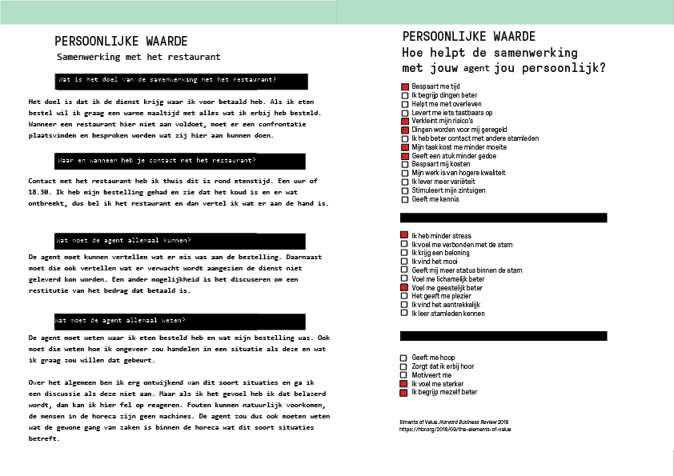
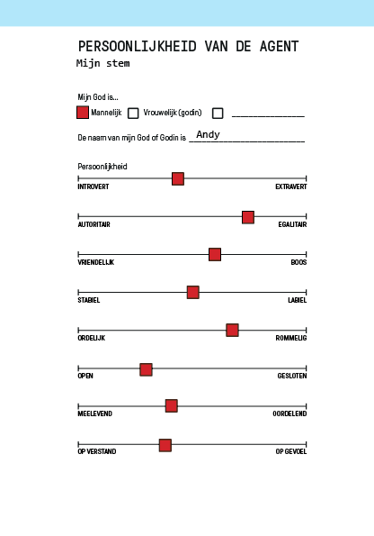

# Lastige gesprekken met lastige mensen

## Opdracht

> Ontwerp en test een voice interface voor een agent die is gebaseerd op jouw eigen persoonlijkheid. De agent automatiseert jouw vervelende gesprekken met moeilijke mensen.

## Concept en design

### Defineer het probleem

Een situatie die ik erg vervelend vind, is als je eten online besteld en het dan na de levering erachter komt dat er iets mis is met de bestelling. De situatie is tergend omdat de bezorger dan weg is, dus je moet contact opnemen met het restaurant of met thuisbezorgd. Dan leg je het probleem uit,  om dan vaak te horen te krijgen dat je de bestelling opnieuw kan krijgen of dat ze een restitutie doen om het een of het ander. Het probleem in het gesprek ligt voor mij aan dat er een driehoeksverhouding is tussen klant, de groep die de order aanneemt \(thuisbezorgd\) en dan het restaurant die het eten maakt. Dus vaak wordt de schuld op de andere afgeschoven en kan geen van de partijen duidelijk vertellen wat er mis is gegaan of wat er gedaan kan worden. Als er wat ontbreekt aan het eten en je krijgt een restitutie van 1 euro op het bedrag, daar zit niemand echt op te wachten. De andere optie is vaak één uur wachten tot dat ze weer het eten kunnen bezorgen. 

### Waarde van de oplossing

Een gewenste uitkomst zou zijn dat het restaurant mij belooft dat mijn order opnieuw bezorgd wordt binnen een half uur en dat ze dit daadwerkelijk nakomen. Dit is waardevol voor mij omdat ik voor een dienst heb betaald en graag wil dat waar ik voor betaal nagekomen wordt. 

### Bedenk een oplossing

### Persona van jouw persoonlijkheid

## Conversational interface

