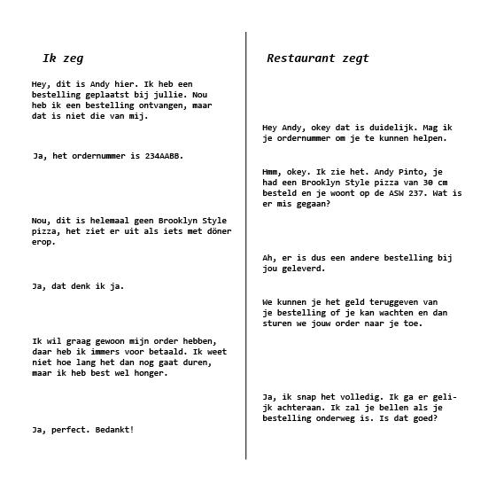
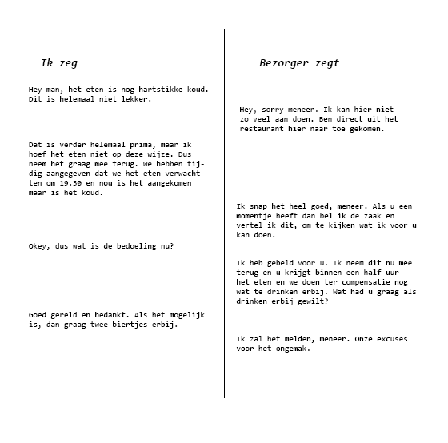
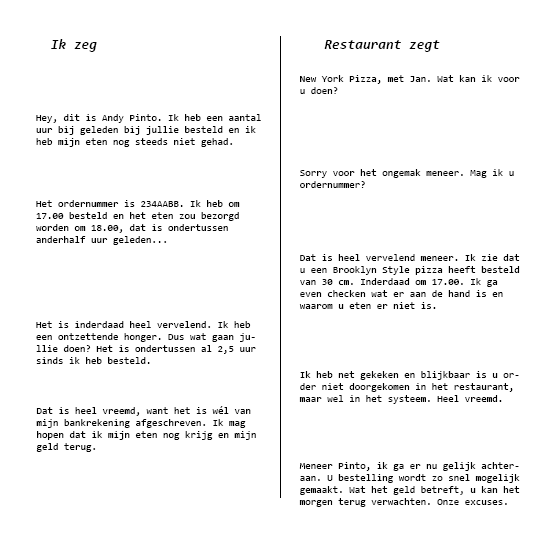
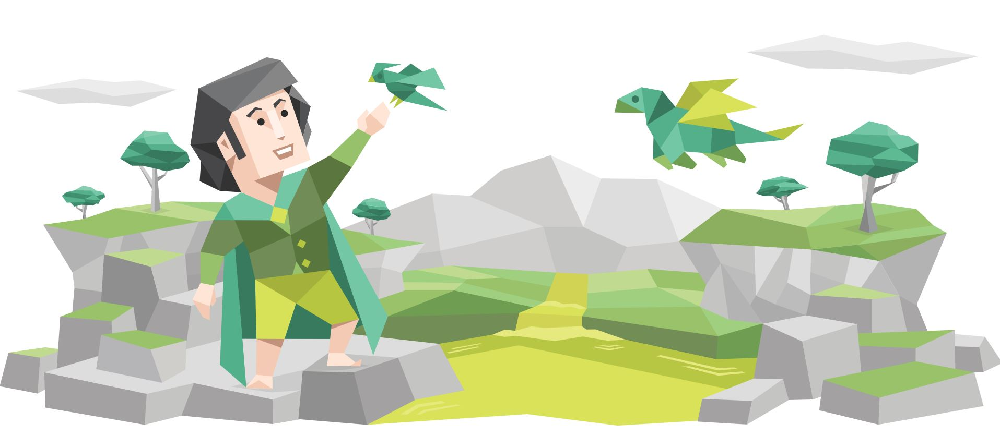

# Lastige gesprekken met lastige mensen

## Opdracht

> Ontwerp en test een voice interface voor een agent die is gebaseerd op jouw eigen persoonlijkheid. De agent automatiseert jouw vervelende gesprekken met moeilijke mensen.

## Concept en design

### Defineer het probleem

> Wat vind jij vervelende gesprekken om te voeren? Welke situaties vermijd je liever? En wie zijn die moeilijke mensen waar je liever geen gesprek mee voert?

Een situatie die ik erg vervelend vind, is als je eten online besteld en het dan na de levering erachter komt dat er iets mis is met de bestelling. De situatie is tergend omdat de bezorger dan weg is, dus je moet contact opnemen met het restaurant of met thuisbezorgd. Dan leg je het probleem uit,  om dan vaak te horen te krijgen dat je de bestelling opnieuw kan krijgen of dat ze een restitutie doen om het een of het ander. Het probleem in het gesprek ligt voor mij aan dat er een driehoeksverhouding is tussen klant, de groep die de order aanneemt \(thuisbezorgd\) en dan het restaurant die het eten maakt. Dus vaak wordt de schuld op de andere afgeschoven en kan geen van de partijen duidelijk vertellen wat er mis is gegaan of wat er gedaan kan worden. Als er wat ontbreekt aan het eten en je krijgt een restitutie van 1 euro op het bedrag, daar zit niemand echt op te wachten. De andere optie is vaak één uur wachten tot dat ze weer het eten kunnen bezorgen. 

### Waarde van de oplossing

> Wat is er een gewenste uitkomst waar zowel jij als de gesprekspartner zich in kunnen vinden? Waarom is dit waardevol voor jou persoonlijk?

Een gewenste uitkomst zou zijn dat het restaurant mij belooft dat mijn order opnieuw bezorgd wordt binnen een half uur en dat ze dit daadwerkelijk nakomen. Dit is waardevol voor mij omdat ik voor een dienst heb betaald en graag wil dat waar ik voor betaal nagekomen wordt. 

### Bedenk een oplossing

> Bedenk meerdere usecases. Maak scenario’s van een aantal kleine, korte gesprekken waarmee je de persoonlijke assisstent kunt demonstreren. Kies een usecase om uit te werken tot een oplossing.

#### Use case 1\# - De bestelling die ik heb gekregen is onjuist. 

Het is vrijdag avond, ik heb de hele week hard gewerkt en onderweg naar huis in de trein bedenk ik me dat ik om het weekend te starten, pizza wil bestellen bij New York. Ik bestel mijn favoriete pizza, de Brooklyn style. Ik vraag dat die om 18.30 geleverd wordt. Thuis aangekomen, pak ik wat te drinken en start ik de serie die ik op dit moment ben aan het kijken. Om 18.30 wordt er aangebeld: "Bestelling voor meneer Pinto", klopt helemaal. Ik neem het aan en als ik achter mijn bureau zit, kom ik erachter dat het niet de Brooklyn Style pizza is die ik had besteld. 

#### Use case 2\# - Het eten dat ik heb ontvangen is koud.

Het is zondagavond en ik ben samen met mijn vriendin. Het is nog een van de laatste dagen dat het lekker weer is, dus we besluiten om met wat drankjes naar het park te gaan en daar te hangen. Het is een uur of 18.00, we willen nog even buiten zijn door het weer, maar hebben geen zin om te koken. We besluiten om eten te bestellen zodat we nog even buiten kunnen zijn.  We geven aan dat het eten om 19.30 bezorgd mag worden. Dan is begint het net met afkoelen dus dan gaan we binnen zitten en kunnen we eten.  Om 19.25 zijn we thuis en aan het wachten op de bestelling. Een paar minuten later wordt er aangebeld en dan komt de bestelling koud aan. Ik roep de bezorger nog na en confronteer hem. 

#### Use case 3\# - Bestelling is te laat

Het is maandag avond, ik heb een druk weekend achter de rug gehad door werk en ben weer vol aan de slag gegaan met school vandaag. Na op en neer naar Amsterdam te zijn geweest voor lessen, ben ik thuis weer doorgegaan met studeren om de deadlines te halen. Het is 17.00 en ik bedenk me dat ik vergeten ben boodschappen te doen voor het avondeten. Ik kies ervoor om snel een pizza te bestellen zodat ik in ieder geval avondeten heb gehad. Ik had aangegeven dat ik het eten zo snel mogelijk bezorgd wilde hebben. Waarop ik te horen kreeg dat het eten rond 18.00 bezorgd zou worden, ideaal. Om 19.30 heb ik nog steeds geen eten en niets gehoord van New York Pizza. 

### Persona van jouw persoonlijkheid

Het is belangrijk om bij dit soort interacties assertief over te komen en niet onnodig agressief. Daarnaast is het van belang om te laten weten wat je verwachte uitkomst is van de situatie. Ik denk dat een combinatie van de twee genoemde persoonlijkheidstrekken er voor zorgen dat de agent het doel behaalt wat ik wil. Om de agent een geloofwaardige versie van mezelf te gaan maken moet ik verder kijken naar wat mijn persoonlijkheid beschrijft. Ik vind mezelf overigens niet agressief, in tegendeel zou ik willen zeggen dat ik behoorlijk conflict vermijdend ben. 

Na het participeren aan de [16 personalities ](https://www.16personalities.com/)test, wordt mijn persoonlijkheid beschreven als een _'meadiator'._ De mediator wordt beschreven als een ware idealist. Altijd zoekend naar het goede in zelfs de 'slechtste' mensen. Het zijn gepassioneerde mensen die zich vaak onbegrepen voelen, maar wanneer een _like-minded_ persoon wordt gevonden, er rust en harmonie te vinden is in gesprekken. Mediators zijn een onderdeel van de diplomantengroep. Wat wilt zeggen volgens het gebruikte model dat mediators meer geleidt worden door principes dan door logica, opwinding of pragmatiek. Mediators laten zich leiden door de intenties die ze hebben en niet door beloning en straffen. 

Een groot gedeelte van deze beschrijving is waar voor me, alleen zijn er enkele nuances. Ik ben een persoon met erg veel geduld. Ik zoek zeker naar het goede in mensen, ook al vind ik ze in eerste instantie mogelijk niet aardig of sympathiek. Ook is het zeker waar dat ik me vaak laat leiden door de intenties en principes die ik heb, maar beloning en bestraffing speelt zeker wél een rol bij mij. 

Om de agent een geloofwaardige versie van mezelf te maken is het nodig dat die assertief is, maar ook geduldig. De agent moet een tone-of-voice hebben waarin het blijkt dat hij niet denkt dat de lastige persoon in kwestie met kwade intenties handelt. Dus inderdaad dat op zoek naar het goede in het gesprek. 

## Conversational interface

## Bronnen

afbeelding mediator [https://storage.googleapis.com/neris/public/images/types/scenes/diplomats\_Mediator\_INFP\_introduction.svg](https://storage.googleapis.com/neris/public/images/types/scenes/diplomats_Mediator_INFP_introduction.svg)

