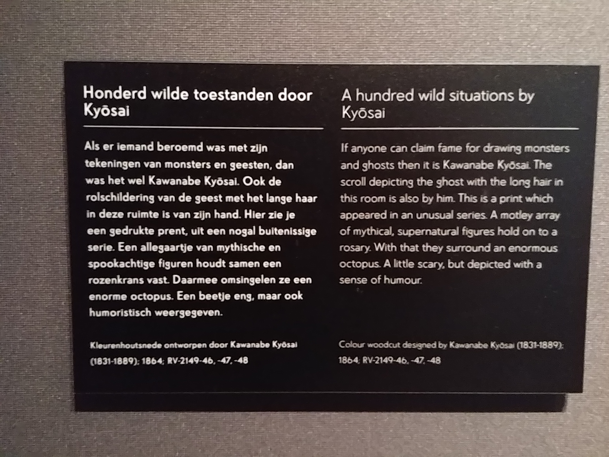

# Museum - Cool Japan

## De expositie

Op vrijdag 11 Januari ben ik samen met Anne Huisman naar het tropen museum geweest voor de expositie _Cool Japan_. Anne en ik zijn allebei fans van japanse pop cultuur. We waren al van plan om een keer te gaan sinds het begin van de expositie. Het vak inspiration gaf een welkome extra motivator om het museum te bezoeken. 

De expositie bevindt zich op het tweede verdieping van het tropen museum en als je binnen komt wordt je verwelkomd door de grote manga verzameling die er beschikbaar is. Er staan genoeg banken in de zaal om rustig te gaan zitten en een aantal manga boeken te lezen. Er zaten een groot aantal klassiekers tussen de manga's, zoals: Akira, Neon Genesis Evangelion, Ghost in the Shell, Dragonball, Naruto, Bleach, Death Note, One Piece, InuYasha en een favoriete van mij 'Blue Exorcist'. 

Een ander gedeelte was nostalgie opwekte, waren de _action figurines_ die tentoongesteld werden. Allemaal van erg populaire manga's en anime series. Het was leuk om te zien en te herkennen van welke series ze allemaal van waren. Ik was ook erg onder de indruk van de waarde van alle beeldjes. 

## Het kunstwerk

Het kunstwerk wat behandeld gaat worden, zijn originele prenten van _Sailor Moon_. Dit was een gigantische hitshow uit de jaren 90. Waarin een meisje genaamd _Bunny Tsukino_ de _Sailor Moon_ is. Dit is een soldaat die voorbestemd is om de mensheid van het kwaad te redden op aarde. In Japan zijn er weinig franchises die het status hebben bereikt van Sailor Moon. Alles is van Sailor Moon te kopen: kleding, school spullen, meubilair, etc. 

De reden dat ik specifiek hier voor heb gekozen, is omdat ik denk dat Sailor Moon iets heeft bereikt wat erg waardevol is. De serie creëert met de show een sterke vrouwelijke karakter en verheerlijkt dit. Dit is iets wat vrij kenmerkend is in japanse pop cultuur. 

Naar mijn idee zijn genderrollen achterhaald. Ik geloof in ieder geval niet dat man of vrouw per se iets moet doen binnen relaties. Of dat in het geval dat een stel van hetzelfde geslacht is, iemand de 'mannenrol' en de andere de 'vrouwenrol' moet aannemen. Een stel zoekt voor zich wat prettig werkt met behulp van goede communicatie. Op dezelfde wijze vind ik dat genderrollen binnen werkomgevingen vrij loos zijn. De positie van mannen in de zorg of vrouwen bij het leger zouden nooit ondermijnd moeten worden. Om terug te komen op Sailor Moon, ik kan erg waarderen dat Bunny wordt neergezet als een sterke vrouwelijke karakter, doch dat ze feminien blijft. Vanuit een meta perspectief kan je nog haar feminiteit ten vraag stellen: "Hoezo, zou ze per se vrouwelijk moeten zijn en rokjes moeten dragen?". Voor mijn gevoel is dit daadwerkelijk wie de karakter is. Het is een jong meisje, die zich graag prettig wilt voelen. Ergens kan je nog stellen dat er duidelijke genderrollen aanwezig zijn bij het karakter van Bunny. Maar er kan gesteld worden dat het karakter inherent zo is. Bunny Tsukino wordt door jonge feministen ook erkend als een voorbeeld van feminisme.

In anime is deze sterke vrouwelijke karakter een terugkomend iets. In de serie Dragonball heb je het karakter Bulma. Zij is getrouwd met Vegeta, één van de sterkste mannen in het hele universum. Toch zijn de meeste mannen bang voor Bulma, omdat ze weten dat zij als ze dat wil haar zin kan krijgen. 

Concluderend, kan ik stellen dat ik de prenten interessant vond door twee redenen. Ze zijn origineel, die prenten hebben in zekere zin geen monitaire waarde en zijn dus prijsloos. Daarnaast, ben ik verder gaan nadenken over genderrollen in de moderne beschaving. 

## Over de expositie

Het bezoek was ontzettend leuk. Ik kan iedereen die van japanse cultuur houdt de expositie aanraden. Als student is het niet zo duur om langs te gaan. Daarnaast is het ook prettig dat de expositie niet gigantisch groot is. Japanse esthetiek heeft mij altijd erg aangesproken. Er zijn ook meer klassiekere kunstwerken te bewonderen als schilderijen en standbeelden. Daarnaast is er nog een hentai sectie die vrij mild was. Al met al, was het erg leuk om de expositie te bezoeken.

## Overige foto's

## Bronnen

Afbeelding 1. Uki Uki van Matsuura Hiroyuki ,afkomstig van: [https://www.tropenmuseum.nl/sites/default/files/styles/hero/public/uki-uki\_perspagina.jpg?h=08d69a97&itok=h-RtcU-F](https://www.tropenmuseum.nl/sites/default/files/styles/hero/public/uki-uki_perspagina.jpg?h=08d69a97&itok=h-RtcU-F).

Afbeelding 7. Bulma van de Dragonball series, afkomstig van: [https://vignette.wikia.nocookie.net/dragonball/images/e/eb/Bulma\_-\_Blood\_Rubies\_-\_000.png/revision/latest?cb=20180809014555](https://vignette.wikia.nocookie.net/dragonball/images/e/eb/Bulma_-_Blood_Rubies_-_000.png/revision/latest?cb=20180809014555).

