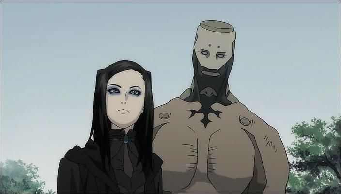

# Activiteit - Ergo Proxy

Voor dit project heb ik, zoals velen, inspiratie gehaald uit science fiction. In het specifiek een anime genaamd _Ergo Proxy_. Het verhaal speelt zich af in een dystopische toekomst, waarbij de mensheid de biosfeer heeft verwoest. Daardoor leven mensen in biodomes.  Afgesloten sferen, waar een gigantische metropool zich in bevindt.

Het verhaal speelt zich af in een toekomst waarbij er volledig autonome robots zijn die Auto Reiv’s heten. Er zijn drie soorten Auto Reiv’s, namelijk de Companion, Entourage en Knight. 

* De companion Auto Reiv is een autonome robot die bedoeld is voor gezelschap. Deze hier heet Pino en is dus ook daadwerkelijk een kind en heeft ook de psyche van een kind.
* De knight Auto Reiv is een robot die bedoeld is enkel om te vechten. Het volgt orders van hun bewindvoerder. Verder interacteren ze niet veel meer.
* De Entourage is een combinatie van de laatste twee rollen. Ze vergezellen hun meester en daarnaast functioneren ze ook als bodyguards. Zo’n entourage auto reiv is hier ook afgebeeld. Deze heet Iggy en hoort bij de hoofdrol karakter Re-L.

## Het cogito virus



Zelfs in deze dystopische setting zijn er utopische elementen. Zoals je kan zien in de interactie tussen de Auto Reiv en Raul Creed \(de man op het laatste stuk\), is er volledig vertrouwen in elkaar en toch blijft de auto reiv luisteren naar haar eigenaar. Ze zou nooit iets doen zonder zijn toestemming. Dit creëert interessante mogelijkheden om naar te streven tijdens het ontwerpen.

Aan het einde van de scene zag je een klein meisje \(Pino\) in een biddende houding. Dit is een mooie brug voor het volgende gedeelte. In het verhaal als auto reivs in contact komen met Proxy’s, dan raken ze besmet met het Cogito virus. Deze virus zorgt ervoor dat auto reivs in bezit komen van een eigen wil en niet dus naar hun eigenaar luisteren, maar naar wat zij willen. 



De serie zette hier voor mij een grote vraagstuk neer. Leeft Iggy nog steeds? Als dat zo is, wordt die als ziek beschouwd? Later in de serie zegt Re-L dat Iggy dood gemaakt moet worden, aangezien die dus ziek is. Zou vanuit een ethisch punt dit mogen? Iggy heeft een leven en een bewustzijn, waarom zou dat anders zijn dan dat van een mens. 

Een grote vraagstuk waar ik me lang mee bezig heb gehouden is of het maken van dergelijke robots wel verantwoord is. Vanuit de jaren 90 is het mogelijk om mensen en dieren te klonen. Genmanipulatie wordt als taboe beschouwd omdat gesteld wordt dat men niet als god mag spelen. Waarom zou het dan wél mogelijk zijn om dit soort robots te maken met een bewustzijn. 

## Bronnen

Afbeelding 1. Gif van Pino, afkomstig van: [https://media1.tenor.com/images/81fe4178450f6b17cb71529694acc2ff/tenor.gif?itemid=12660755](https://media1.tenor.com/images/81fe4178450f6b17cb71529694acc2ff/tenor.gif?itemid=12660755).

Afbeelding 2. Iggy met Re-L, afkomstig van: [https://i.pinimg.com/originals/dd/67/d4/dd67d48733e4788f97a2892adb630829.jpg](https://i.pinimg.com/originals/dd/67/d4/dd67d48733e4788f97a2892adb630829.jpg).

