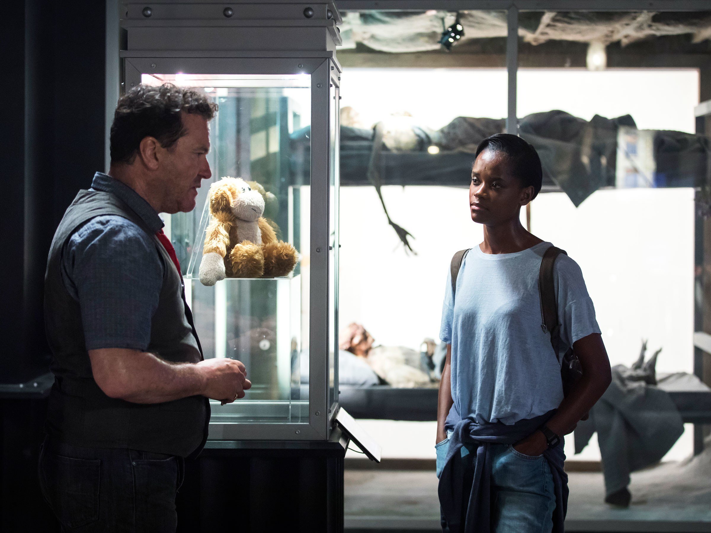
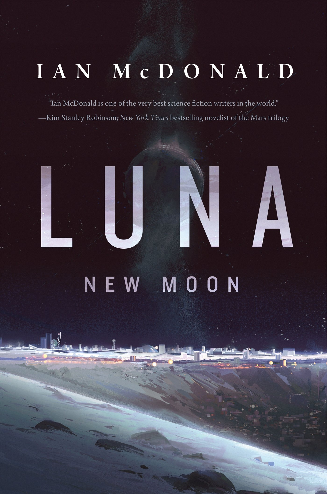
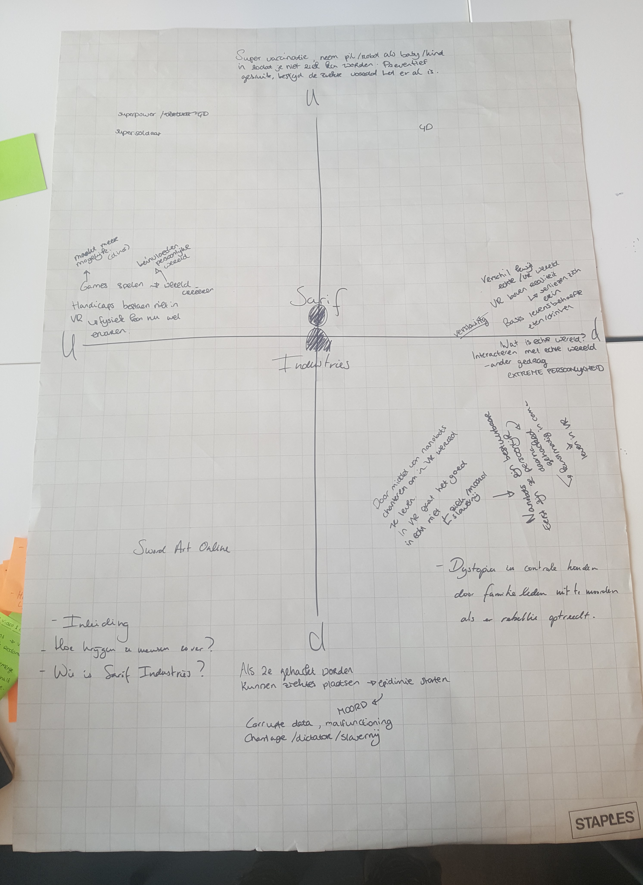
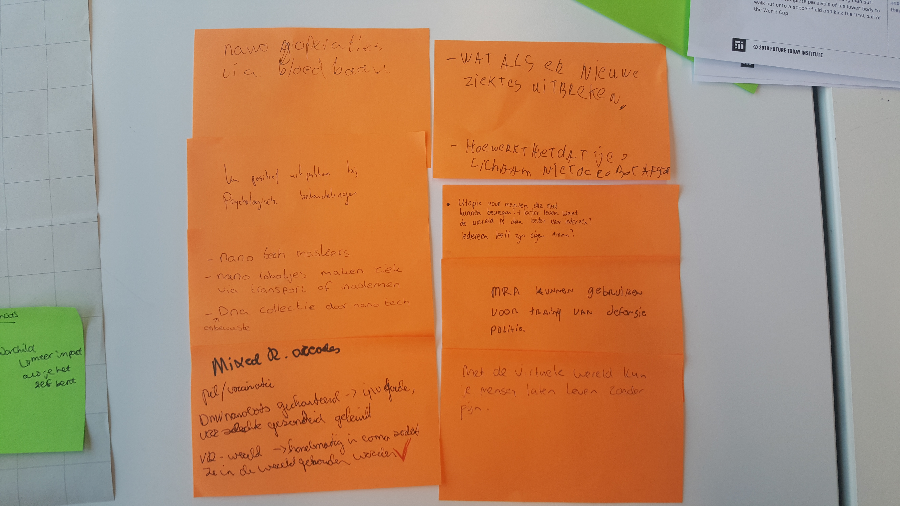

# Inspiration Week

## Black Museum - Black Mirror

Op zijn aller eerst vond ik het interessant hoe het gevoel wordt gecreëerd dat dit zich een tijd geleden afspeelt, tot opeens er een aantal zonnepanelen uit de laadbak worden getrokken om de accu in de auto op te laden. Het is een leuke mogelijkheid om auto's op energie van de zon te hebben rijden die daadwerkelijk een functionele radius hebben. 

Het idee om kennis over te brengen tussen individuen is natuurlijk erg intrigerend. Het zou zoveel implicaties hebben om dit te kunnen doen. Zowel negatieve als positieve. Iedereen zou een arts kunnen zijn en verstand hebben maar complexe kwesties. Echter, zou iedereen zich constant met alles bemoeien. Er zou geen normaal verdeling zijn van IQ, of juist wel door de kosten van zo'n transfer van informatie. Dus misschien wordt het verschil tussen de socio-economische klassen nog groter hierdoor. 

Dezelfde mogelijke implicaties gelden voor het voelen van de sensaties en perceptie van een ander individu. De scala aan medische implicaties zouden natuurlijk gigantisch zijn, zoals ze worden laten zien in de aflevering. Ik vind het erg interessant hoe in het verhaal Dawson zich ontwikkelde met de technologie die bedacht is. Voor mijn gevoel is deze negatieve uitpak erg reëel. Een idee kan utopische gevolgen hebben en de betrokkenen ook positieve bedoelingen, maar wie zegt dat dat ook daadwerkelijk is wat er gaat gebeuren.

Wat een inspirerende werking had op me, was hoe in zekere zin hetzelfde idee \(sensaties en perceptie van iemand anders ervaren\) weer op tweede manier wordt uitgewerkt wat later in het verhaal. Vaak blijf ik steken op één executie van een idee. Zo kan je zien dat je meer kan doen met een concept. Het hele bewustzijn wordt hier meegenomen naar een ander individu. Daar hoort wat meer bij natuurlijk dan alleen sensatie en perceptie. Het was ook wel erg grappig tijdens het kijken, dat de 'drager' binnen een scene van gelukkig, naar schizoïde gaat. Naarmate ik verder kijk blijf ik me verbazen over hoe de schrijvers op het idee zijn gekomen hiervoor. De discussie over de ethiek van iemand in een vegetatieve staat te euthaniseren. Als je verder denkt over wat het inhoudt om het bewustzijn van die persoon \(bewustzijn in vegetatieve staat is een andere vraag\) in een ander persoon te stoppen en later in een object waarvan de communicatie mogelijkheden ontzettend beperkt zijn, is weer een ander verhaal. 

## The Falls: A Luna Story - Ian McDonald

Er wordt voornamelijk beschreven hoe mensen interacteren met AI in de wereld kolonie op de maan. Het verhaal beschrijft grotendeels hoe AI zich gedraagt tegen mensen en hoe ze geïntegreerd zijn in socio-maatschappelijke conventies. Ze hebben immers eigen voornaamwoorden. Er wordt ook een pleidooi gehouden waarom AI emoties moeten hebben. Wellicht niet hetzelfde als mensen ze ervaren, maar een analogie van wat menselijke emoties zijn. 

Deze vormen van AI zijn overal in het wereldbeeld op de maan \(_ha-ha_\). Het zijn in zekere zin andere _mensen_ of misschien beter gezegd, bewuste of gewetensvolle entiteiten die een plaats hebben op de wereld. Zij helpen mensen en mensen andersom door middel van contracten. De AI's voeren taken uit die mensen niet kunnen doen door \(e.g.\) fysieke beperkingen van mensen. Andersom helpen mensen de AI's, zoals de hoofdpersonage dit doen, door middel van therapie. 

De interacties tussen mensen en AI zijn in deze short story erg gewetensvol. Wat ik daarmee bedoel is dat de conversaties op dezelfde wijze plaats vinden als tussen twee personen. Echter is er een duidelijk verschil in positie tussen mensen en AI's. Er is dus wél de erkenning dat beiden niet hetzelfde zijn, ook al zijn beiden gewetensvolle entiteiten en worden deze verschillen gerespecteerd. Dit merk je aan het dialoog vroeg in het stuk waarin Castillo de hoofdpersonage erop wijst dat deze niet de juiste voornaamwoorden gebruikt. Er vindt schaamte plaats hiervoor, waarna ook duidelijk een meningsverschil ontstaat over wat nou de geschiedenis is van de maan.

Al en al, in dit korte verhaal speelt AI een belangrijke rol in het dagelijkse leven op de maan. Zij zijn een gedeelte van het dagelijkse leven, waarbij er interactie plaats vindt tussen de mensen op de maan en het AI. Overigens zijn er veel andere technologieën die gebruikt worden op de maan, maar die meer op de achtergrond vallen van het verhaal. Er is complexe technologie nodig om leven op de maan mogelijk te maken. Een voorbeeld daarvan zijn de filters die de stof uit de lucht filteren. Een mogelijk andere voorbeeld zou de capsules kunnen zijn waar ze in leven en de treinen en poorten die besproken worden in het verhaal. De AI heeft een prominente rol op de leven op de maan in de toekomst.  

## Eerste Scenario's 

**Inleiding**

Tijdens het bedenken van mogelijke scenario’s, hebben we met de groep drie trends gekozen.

1. Human-Machine Interfaces
2. Mixed Reality Arcades
3. Self-Assembling Robots

Vanuit hier zijn we op de eerste vorm van een scenario gekomen. Waarbij mensen in een kunstmatige coma zijn gebracht, waarbij zij leven in een VR wereld. De kunstmatige coma wordt in stand gehouden door de Self-Assembling Robots die in het lichaam van iedereen zitten.

* **Wie is Sarif Industries?**

Sarif Industries was oorspronkelijk een bedrijf gespecialiseerd in het ontwerpen en produceren van high-tech prothesen om mensen met specifieke behoeftes van implantaties te voorzien. Echter zijn de zogenoemde “Augments” een commodity geworden en beginnen winsten van het bedrijf te dalen. Om voor te blijven op de concurrentie is het noodzakelijk dat Sarif met de tijden meegaat, en dat betekent investeren in opkomende technologie, namelijk virtual reality en nanotech.

* **Hoe hebben ze mensen zo ver gekregen?**

In het begin was er sprake van een testfase. Hierin nodigde Sarif Industries proefpersonen uit om nieuwe virtual reality en nanotech te testen tegen een vergoeding. Mensen werden in een virtuele wereld gezet door middel van een VR bril en namen nanobots in als een onderdeel van de test.

Tijdens het leven in de virtuele wereld zouden de nanobots sommige lichaamsfuncties overnemen en er zelfs voor zorgen dat de spieren van de testers niet zouden atrofiëren, wat een direct gevolg zou zijn van de weinige lichaamsbeweging. Omdat in het beginstadium alleen de positieve effect aan het licht kwamen werd dit klakkeloos geaccepteerd.

**Beschrijf de mensen**

Er zijn verschillende soorten mensen tijdens dit proces. Als eerste heb je de testfase. Dat zijn voornamelijk mensen die snel getriggerd raken om iets nieuws uit te proberen, of gebruikers die snel en eenvoudig geld willen verdienen.  
Nadat de testfase is afgerond, krijg je mensen die het ook daadwerkelijk gaan gebruiken. Hierin zullen ook verschillende soorten gebruikers zijn. Namelijk mensen die graag de VR gebruiken zodat zij in een wereld kunnen leven die zij nooit op de echte wereld kunnen doen. Mensen die niet meer het verschil zien tussen de realiteit en virtuele wereld. En mensen die verslaafd zijn aan de VR brillen.

* **Hoe ziet de VR wereld eruit waar mensen in zitten?**

De VR wereld is een wereld die op zichzelf bestaat. Mensen leiden hier hun leven. Zij hebben een manier om een inkomen te genereren. Dit inkomen zorgt ervoor dat zij in de werkelijke wereld worden voorzien van genoeg voedingsstoffen en water.  In de VR wereld kunnen zij hiermee spullen kopen als kleding, upgrades etc.  

## Ghost In The Shell

De technologie die voornamelijk beschreven wordt, zijn de cyborgs. Mensen die een bionische lichaam hebben. Met andere woorden een gedeelte van hun lichaam is niet meer biologisch maar een artificieel lichaam. De vraag die wordt gesteld tijdens de film is in hoeverre al deze personen nog mensen zijn. In hoeverre zijn zij niet meer dan een _ghost,_ een ziel, in een _shell,_ het kunstmatige lichaam. 

De technologieën maken een deel uit van het dagelijks leven. Veel mensen die belangrijke banen hebben of veel geld verdienen zijn ook cyborgs. Het is een manier om mensen te verzekeren van een super lichaam waarmee zij taken kunnen uitvoeren die een _normale_ persoon niet kan doen. Dit is dan ook de reden dat de er veiligheidsdiensten zijn die gewone burgers een upgrade aanbieden, tegen een vaste baan bij de veiligheidsdienst. Het is dus zeer gevaarlijk werk, maar je krijgt er wel behoorlijk wat voor. Verbeterde cognitief vermogen en fysieke capaciteiten. Echter, op het moment dat het contract beëindigd zou worden, worden ook alle kunstmatige delen weer weg genomen. Zoals ook de film te zien is, hebben dit soort praktijken ook de politiek geïnfiltreerd. Hoge piefen laten zich ombouwen om zo hun werkzaamheden beter en sneller te kunnen verrichten.  

De interactie tussen de mensen en deze technologie is organisch. Het zou misschien beschreven kunnen worden als een vorm van symbiose. De technologie heeft de mensen nodig om te werken en de mensen hebben de technologie nodig om te kunnen presteren. Het was interessant om te zien hoe laks er om wordt gegaan met een artificieel lichaam. Als er delen stuk gaan, kunnen deze gemaakt worden. In het ergste geval kan er een geheel nieuw lichaam worden gekocht en daar de _ghost,_ ziel, van de persoon in gestopt worden. 

Een laatste technologie die wordt beschreven is een vorm van AI, dat voor mijn gevoel AI zoals wij dat nu kennen al voorbij is. Ik bedoel hiermee _The Puppet Master._ Het zegt dat het gemaakt is door mensen en met behulp van alle informatie die beschikbaar was, uiteindelijk besloot dat de essentie van het mensen bestaan reproductie en sterven is. Dit bekritiseerd de vraag over de ethiek van cyborgs voor mijn gevoel behoorlijk.  Ik vind het in ieder geval erg interessant om na te denken over hoe een AI, die gigantische hoeveelheden informatie tot de conclusie is gekomen om een leven te leiden zoals mensen die doen. Zich reproduceren en uiteindelijk dan ook in een menselijk brein en lichaam te sterven. Misschien is toch het idee van eeuwig leven zelfs voor een AI niet smakelijk en houden zij hier liever afstand van. 

> _If man realizes technology is within reach, he achieves it. Like it's damn near instinctive."_
>
> "_Your effort to remain what you are, is what limits you"_

