# Het design

## Teleportation door werpen

Het ontwerp moet een vernieuwing zijn voor teleportatie binnen de VR wereld. De speler moet een voorwerp werpen, waarna de speler kan kiezen wanneer hij naar dat voorwerp kan teleporteren met de druk van een knop op de controller. Hier zal verder beschreven worden hoe het concept zal werken, overig onderzoek naar het verwerkelijken van het concept in een prototype en wat voor stappen hiervoor genomen moeten worden. 

## Het ontwerp

Tijdens het eerdere onderzoek naar teleportatie binnen VR games is er inspiratie opgedaan wat betreft de mogelijkheden die er zijn. Met behulp van de inspiratie zijn er eerste ideeën opgedaan, voornamelijk kijkend naar Robo Recall. Na een extra keer testen, ben ik er toch achter gekomen dat Robo Recall de teleportation goed op orde had en dat het moeilijk is om dit nog te verbeteren. 

### Het eerste idee

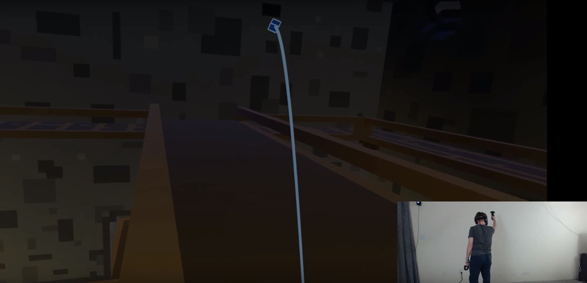

Spells 'n Stuff was het eerste aangrijpingspunt voor het ontwerp. In dit spel werp je een een voorwerp om dan te teleporteren naar de locatie waar dat voorwerp landt. Echter vond ik dat hier een tekort was aan agency voor de speler wat de primaire vorm van beweging betreft binnen de game. Als de speler namelijk het voorwerp gooit, dan vindt de teleportatie plaatst, ongeacht van waar het voorwerp landt. Waardoor er gevallen zijn waarin de speler verkeerd gooit, het voorwerp in een klein hoekje landt en de speler naar de hoek wordt geteleporteerd. Als een speler het niet eens is met de locatie voor de teleportatie, moet de worp verbeterd kunnen worden. Anders moet de speler terug teleporteren naar de oorspronkelijke locatie, of in ieder geval zichzelf moeten herpositioneren. 


### De design challenges

#### Hoe kan een speler door een virtuele wereld zich verplaatsen door een werp mechaniek?

Één van de eerste problemen waar ik op stuitte tijdens het bedenken van de mechaniek was: "Wat is de perspectief van de speler na de teleportatie?". Verschillende opties hebben voor- en nadelen. Daardoor ben ik verder gaan kijken naar Spells 'n Stuff, misschien hebben zij een interessante mechaniek hiervoor. Echter, viel dit tegen zoals hieronder afgebeeld. Zoals je kan zien, behoudt de speler exact dezelfde perspectief van het exacte moment voor dat het teleportatie voorwerp landt. Hierdoor krijg je wat hieronder is afgebeeld. Het voorwerp landt dichtbij een muur en vervolgens staart de speler naar een muur. Ik wil graag hierin de speler nogmaals wat meer agency in geven en zorgen dat de speler baas is over zijn beweging in de virtuele wereld. 

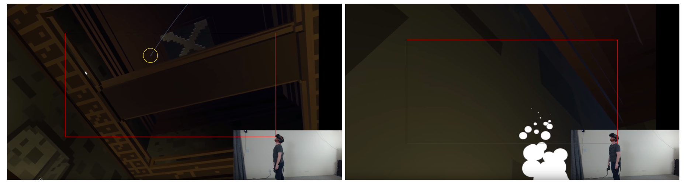

Een eerste oplossing voor dit probleem leek te zijn dat de perspectief van de speler over de x-as wordt gespiegeld na teleportatie. Echter heeft dit een groot probleem voor beweging over grote ruimtes. Zoals afgebeeld is hieronder in vak 2.1. Wanneer de speler zich voorwaarts wilt verplaatsen, moet hij telkens 180 graden draaien, om dan de worp te doen, te teleporteren en dit allemaal weer te herhalen. Nogal onhandig. Terwijl, als we de manier gebruiken die bij Spells 'n Stuff doen, dan zien we dat speler met enkel de worp zich door de ruimte kan verplaatsen. 

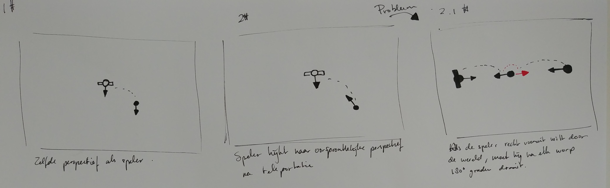

Om dit tekort op te lossen is het volgende bedacht; vanuit dezelfde gedachten om de speler zoveel mogelijk agency te geven over zijn beweging door de virtuele wereld. De speler krijgt de mogelijkheid om met de druk van een knop te beslissen of hij dezelfde perspectief wilt behouden of richting de plek wilt kijken waar hij oorspronkelijk vandaan komt. Ter verduidelijking is wordt hieronder afgebeeld wat het concept inhoudt. Op kader 3\# is te zien met behulp van de zwarte en blauwe pijlen uit de richtingen waar de speler uit kan kiezen. In kader 3.1\# wordt een mogelijke implementatie van dit concept laten zien. De speler kan met behulp van deze mechaniek vijanden proberen te vermijden en hen op deze manier verrassen. Toch is het dus mogelijk voor de speler om door een ruimte voorwaarts te bewegen zonder iets aan hun perspectief te moeten doen \(kader 3.2\#\). 

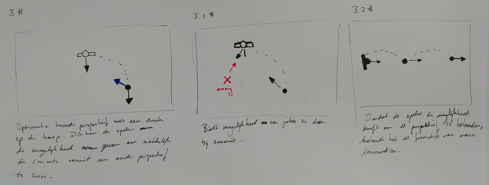

#### Revisie van het eerste ontwerp

Na een kritische blik te hebben gegeven aan het eerste idee, viel me een gebrek op aan het ontwerp. Ik wil graag de speler zo veel mogelijk agency geven over zijn beweging binnen de virtuele wereld. Waarom zou ik dan zijn keuze in perspectieven na de teleportatie beperken? Beter gezegd, wat is het nut van de speler enkel twee opties te geven voor waar hij naar toe kijkt naar de teleportatie. Met behulp van wat schetsen en kijken naar andere VR games, is het concept dan toch licht veranderd. De speler moet namelijk de keuze hebben om naar elk mogelijke richting te kijken die hij wilt. Zoals in afbeelding 6 wordt geïllustreerd \(linkse kader\), kan de speler elke kan op kijken na de teleportatie. Indien de speler geen voorkeur van perspectief aangeeft, behoudt de speler zijn oorspronkelijke perspectief. 

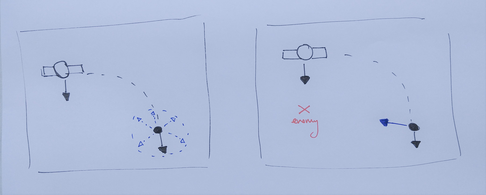

Het is belangrijk om te benadrukken dat de perspectief van de speler enkel over de x-as veranderd. Beter gezegd, de richting over de y-as van de perspectief van de speler wordt niet veranderd. Als een speler richting het plafond kijkt, dan blijft dat zo. Afbeelding 7 beschrijft dit nader en de verbetering die het concept biedt. Kader 1 en 2 zijn een herhaling van afbeelding 3. Kaders 3 en 4 illustreren de nieuwe mogelijkheden voor de speler na de teleportatie. Zoals te zien is in kader 3, werpt de speler zijn teleportatie voorwerp, hetzelfde zoals in kader 1. Echter draait de speler nu de perspectief waar hij naar toe wilt kijken na het teleporteren. De blauwe stickfigure moet de speler voorstellen op zijn teleportatie locatie, met de nieuwe perspectief. De verschillen tussen kader 2 en 4 moeten dit verschil voorstellen. Als oriëntatiepunt is de kruis in het plafond benadrukt met gele lijnen. Zoals te zien is, blijft de speler richting het plafond kijken. Dit is wat bedoeld werd over de richting van de y-as van de speler en dat die onveranderd bleef. 

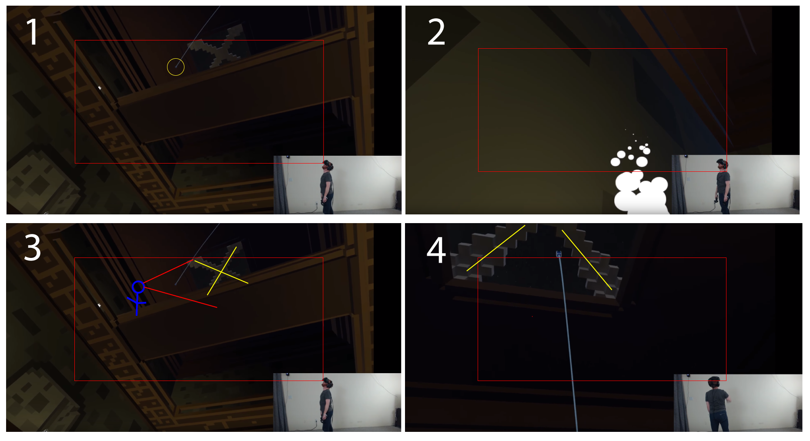

####  Hoe kan de speler deze mechaniek toepassen met de touch controller van de Gear VR?

Zoals op afbeelding 7 zichtbaar is, is de controller voor de Gear VR relatief beperkt. Er zijn twee knoppen beschikbaar, waarvan de touchpad ook als digitale joystick kan werken. Met wat meer modificaties in de code kan de 'Back Button' ook fungeren als een bruikbare knop waar acties mee uitgevoerd kunnen worden. Maar in zekere zin, moet het werken met twee verschillende knoppen. De _Trigger_ is de knop die gebruikt gaat worden om het teleportatievoorwerp te pakken. De speler kan dan zwaaien met de Touch Controller en de trigger loslaten tijdens de beweging om het voorwerp te werpen. Nadat het voorwerp geland is, kan de speler de oriëntatie van de perspectief kiezen met behulp van de _Touchpad_. Door te sliden vanaf het midden punt naar de zijden van de touchpad kiest de speler de richting van de perspectief. De touchpad zelf fungeert ook als knop,  dus wanneer de speler wilt teleporteren, drukt hij de touchpad door tot de klik. Indien de speler niet eens is met de locatie van het voorwerp, kan hij nog een keer de trigger indrukken. Hierdoor pakt de speler een nieuw teleportatie voorwerp en kan hij deze weer werpen.

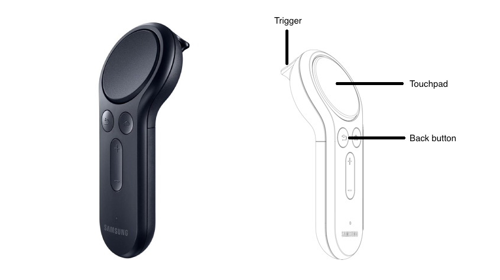

## Het coderen

### De Bézier curve

Het eerste term wat veelvuldig terug kwam tijdens het zoeken naar code voorbeelden en tutorials was de Bézier Curve. In dit volgende artikel wordt duidelijk geïllustreerd wat dit concept precies is. Dit concept stelt het mogelijk om een curve te maken, aan de hand van een mobiel punt, dat lijnen tussen een n-aantal vaste punten volgt. Indien dit nog te onduidelijk is, volg de link en bekijk de veel zeggende animaties. Dit is meer van belang voor teleportatie technieken. Het is om te uiten wat de teleportatie locatie wordt van de speler ten aanzicht van de positie van de controller. 



### Oculus Developers \| Uitleg over teleport curves met de Gear VR controller



In dit artikel wordt nader beschreven hoe de Bézier curves werken en hoe ze geïmplementeerd moeten worden in een teleportation mechaniek. Daarnaast wordt verteld dat de _Oculus Utilities for Unity_ geïnstalleerd moet worden om gebruik te kunnen maken van een project die Oculus beschikbaar heeft gemaakt op een drietal vormen van teleportatie te testen. De vormen worden nader beschreven in het artikel. Hieronder worden ze kort beschreven.

#### Bèzier Locomotion

Bij bèzier locomotion zijn er drie punten\(`Px`\) die samen een driehoek vormen. Tussen `P1` en `P2` loopt een punt, tussen `P2` en `P3` ook. Dit zijn de rode cirkels. `Q2` \(gele cirkel\) loopt tussen deze twee rode punten. Op deze manier wordt er een curve gevormd. Een voordeel van locomotion zo bereken in plaats van een daadwerkelijke curve te laten renderen met behulp van de physics van de Unity Engine is dat dit veel lichter is om te berekenen. 

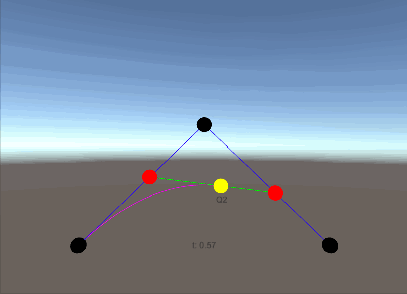

####  Parabolic Locomotion

De naam spreek redelijk voor zich. Met behulp van een parabool wordt een ark berekend. Dit wordt aan de hand gedaan van de volgende formule: 

```text
y = position + velocity * t + 1/2acceleration * t^2
```

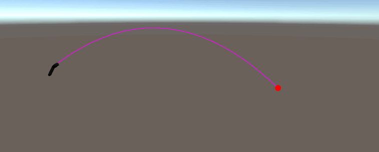

####  Tall Locomotion

Deze manier van teleportatie zendt een straal uit van boven de speler. Dit is het rode punt. De positie van de controller \(hoek\) heeft geen impact bij deze vorm van teleportatie. Dit is het minst zware manier van teleportatie van deze drie wat betreft rekenkracht. 

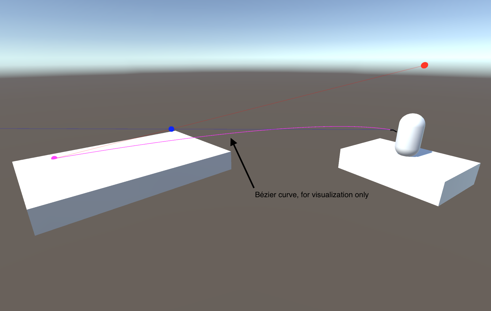

### Teleportation tutorial voor de Gear VR

{% embed data="{\"url\":\"https://www.youtube.com/watch?v=DRzGEHZKeic\",\"type\":\"video\",\"title\":\"Oculus Mobile VR Tutorial: Gear VR + Controller Teleport with Bezier Curves\",\"description\":\"We know ~10k views was aiming a bit high... aim big!!! Share out the video and we\'ll port Robo Recall mechanics over to mobile VR!\\n\\nCheck out our implementation of a teleport mechanic using bezier curves on Gear VR! It\'s going to be a huge year for mobile VR, so let\'s get building. We\'ll talk about our code setup, controller input, Gear VR debugging, and drawing the teleport curve. \\n\\nAnimated Bezier Curve : https://www.jasondavies.com/animated-bezier/\\n\\nWikipedia Bezier Curve : https://en.wikipedia.org/wiki/B%C3%A9zier\_curve\\n\\nSuggestions for future videos :  https://waffle.io/FusedVR/FusedVR-Community-Repo\\n\\nProject Repo: https://github.com/FusedVR/GearTeleporter\\n\\nOculus Utilities: https://developer.oculus.com/downloads/package/oculus-utilities-for-unity-5/\\n\\nLog Unity Messages on ADB: adb logcat -s Unity ActivityManager PackageManager dalvikvm DEBUG\\n\\nDid you know we released a new game? Download ARtillery Bay for iOS 11: https://itunes.apple.com/us/app/artillery-bay/id1296690301?mt=8&ign-mpt=uo%3D4\\n\\nWelcome to the weekly FusedVR Tutorials! These videos/streams are a chance not only for anyone to learn more about AR/VR development, but also a chance for anyone to ask questions about LITERALLY anything! Whether it be about your own AR/VR development, your future projects, or just AR/VR in general, we would love to talk with you about it!\\n\\nInterested in keeping up to date with the live streams? Follow us on social media or subscribe to the channel!\\n\\nhttps://www.facebook.com/FusedVR/\\nhttps://twitter.com/FusedVR\\nhttps://www.instagram.com/fusedvr/\\nhttps://medium.com/fusedvr\\nhttp://bit.ly/1SZXwtn\",\"icon\":{\"type\":\"icon\",\"url\":\"https://www.youtube.com/yts/img/favicon\_144-vfliLAfaB.png\",\"width\":144,\"height\":144,\"aspectRatio\":1},\"thumbnail\":{\"type\":\"thumbnail\",\"url\":\"https://i.ytimg.com/vi/DRzGEHZKeic/maxresdefault.jpg\",\"width\":1280,\"height\":720,\"aspectRatio\":0.5625},\"embed\":{\"type\":\"player\",\"url\":\"https://www.youtube.com/embed/DRzGEHZKeic?rel=0&showinfo=0\",\"html\":\"<div style=\\\"left: 0; width: 100%; height: 0; position: relative; padding-bottom: 56.2493%;\\\"><iframe src=\\\"https://www.youtube.com/embed/DRzGEHZKeic?rel=0&amp;showinfo=0\\\" style=\\\"border: 0; top: 0; left: 0; width: 100%; height: 100%; position: absolute;\\\" allowfullscreen scrolling=\\\"no\\\"></iframe></div>\",\"aspectRatio\":1.7778}}" %}

In deze video krijg je van uit de developers een Unity Project waar ze de manier van teleportatie van Robo Recall hebben nagebootst op de Gear VR. Er wordt in de video nog uitleg gegeven over hoe de belangrijkste functionaliteiten werken. Een aantal stukken van de belangrijke code worden hieronder beschreven.

#### Hoe werkt de controller trigger?

Hieronder staat de code voor die zorgt dat de speler met de controller de teleportatie kan doen. De code checkt of de speler binnen tijdsbereik `doubleClickTimeLimit = 0.5f` tweemaal de trigger indrukt om zo de teleportatie procedure te starten. Dit wordt gedaan om te zorgen dat de speler niet per ongeluk teleporteert door een misclick op de trigger. 

```text
    void UpdateTeleportEnabled() {
        if (OVRInput.GetDown(OVRInput.Button.PrimaryIndexTrigger)) { // The trigger is pressed.
            if (!firstClick) { // The first click is detected.
                firstClick = true;
                firstClickTime = Time.unscaledTime;
            } else { // The second click detected, so toggle teleport mode.
                firstClick = false;
                ToggleTeleportMode();
            }
        }

        if (Time.unscaledTime - firstClickTime > doubleClickTimeLimit) { // Time for the double click has run out.
            firstClick = false;
        }
    }

    
```

#### Hoe werkt de teleportatie?

`HandleTeleport()` is een functie die elke frame runt. De eerste if-statement checkt of dus de bèzier curve nog daadwerkelijk op iets landt. De voorwaarden zullen wel wat genuanceerder zijn binnen Unity \(collision of rigidbodies\). Als dit het geval is wordt aangegeven dat er de mogelijkheid is tot teleportatie. De tweede if-statement vertelt dat wanneer dan de speler op `OVRInput.Button.One` \(de touchpad\) drukt, dan teleporteert de speler daadwerkelijk naar de locatie. 

```text
    void HandleTeleport() {
        if (bezier.endPointDetected) { // There is a point to teleport to.
            // Display the teleport point.
            teleportSprite.SetActive(true);
            teleportSprite.transform.position = bezier.EndPoint;

            if (OVRInput.GetDown(OVRInput.Button.One)) // Teleport to the position.
                TeleportToPosition(bezier.EndPoint);
        } else {
            teleportSprite.SetActive(false);
        }
    }
```

### Oculus Developers \| Interacteren van een UI met Gear VR controller 



Het artikel wat hieronder staat, was interessant geweest om toe te passen in het prototype mits er meer tijd was geweest hiervoor. In dit artikel wordt met behulp van een aantal packages en wat verandering in code gezorgd dat de Gear VR controller dingen vast kan pakken. Niet zo zeer als dit met een Oculus zou gebeuren. Op een meer primitieve manier wordt gezorgd dat de speler met een Gear VR Controller dingen kan vastpakken, bewegen en ermee kan interacteren. Dit is afgebeeld hieronder.

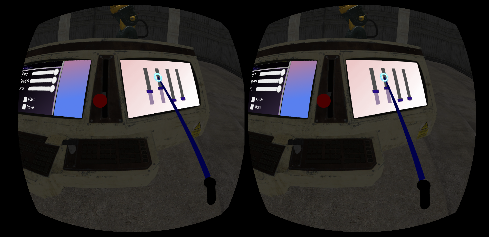

## Het prototype

Met behulp van de Oculus Developers blog is er een prototype tot stand gekomen. In het specifiek het artikel van Szauer \(2017\) genaamd "Teleport Curves with the Gear VR Controller". Het prototype is gericht op teleportatie in VR met de Gear VR en de bijpassende controller. Er zijn drie verschillende vormen van teleportatie beschikbaar in drie verschillende scenes. De bèzier teleportation, parabolic teleportation en tall teleportation. 

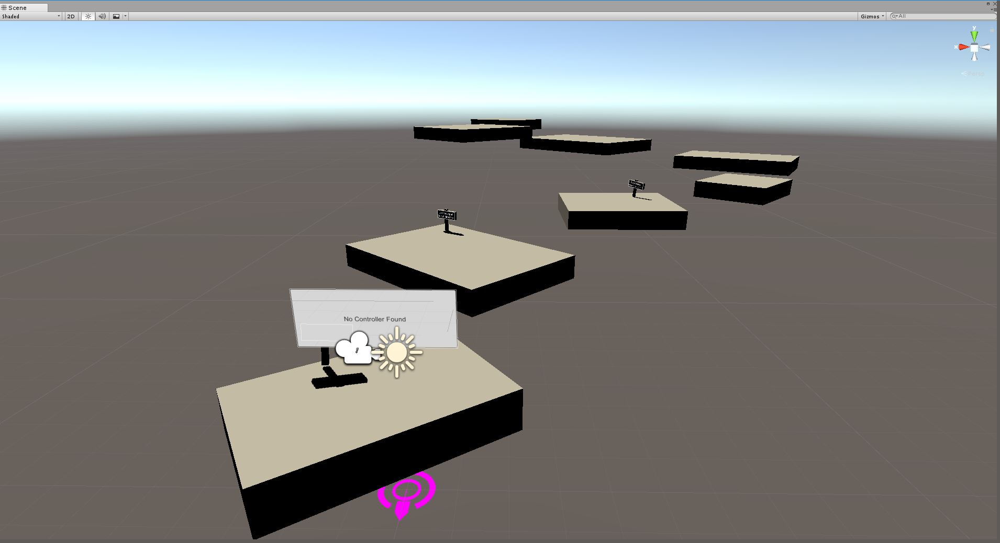

  
Wanneer de app wordt gestart en de speler in de VR scene terecht komt, wordt via een prop vertelt aan de speler hoe hij kan teleporteren met de Gear VR Touch controller. Dit is de eerste stap in de teleportatie. Het volgende platform is bewust recht voor de speler gezet. 

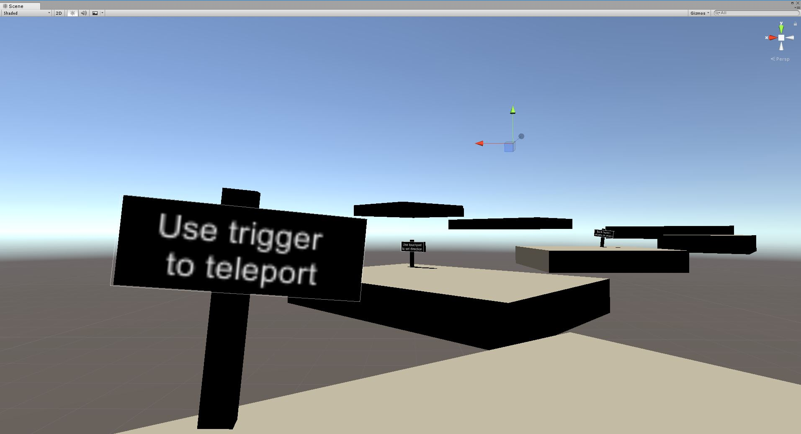

  
Vanaf het tweede platform wordt de speler geïnformeerd over de mogelijkheid om van perspectief te veranderen. Dit wordt nogmaals gedaan via een prop. Ook wordt de speler vertelt hoe hij terug kan gaan naar het home menu. 

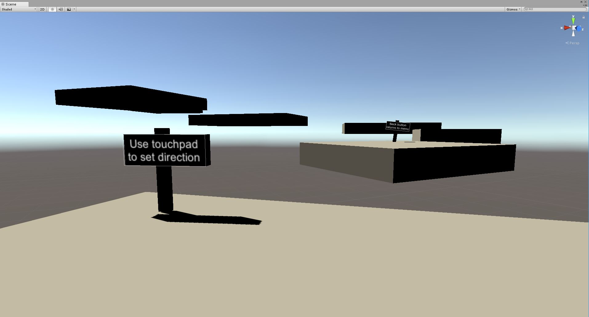

## Conclusie

Zoals te zien is, is het onderzoek behoorlijk breed gelopen. Dit kwam door de factor dat er weinig informatie te vinden was over hoe objecten vast gehouden en geworpen konden worden met de Gear VR en de bijpassende Touch controller. Daardoor heb ik uiteindelijk gekozen om het prototype te richten op hoe teleportatie alsnog behaald kan worden met de hardware die beschikbaar was. 

Concluderend kan ik zeggen dat de mechaniek, zoals in eerdere hoofdstukken beschreven, moeilijk voltooid kan worden met de Gear VR. Er zijn ongetwijfeld manieren om de werp mechaniek na te bootsen op een Gear VR. Echter lijkt me dit een omslachtige manier teleportatie. Voor mijn gevoel wordt het niveau agency wat ik de speler wil geven over zijn primaire bewegingsfuncties niet bereik met deze hardware. Voor een propere toepassing van deze mechaniek zou gekeken moeten worden naar toepassingen hiervan op de Oculus Rift of HTC Vive. In ieder geval zou hardware gebruikt moeten worden die de beweging van de armen kan waarnemen met behulp van sensoren. 

Voor het eindproject zijn er een aantal dingen wat ik zou willen onderzoeken en vervolgens in een prototype zou willen toepassen. Dit zou ik allemaal graag willen onderzoeken voor de Oculus Rift:

* Hoe kan de speler een voorwerp vastpakken?
* Hoe kan de speler met de druk van een knop een voorwerp in zijn hand hebben?
* Als de speler het voorwerp kinetische energie geeft en dan loslaat, behoudt het voorwerp dat energie?
  * Als dit niet het geval is, hoe zorg ik dat het voorwerp een projectiel wordt binnen de Unity Engine?
* Hoe wordt de speler geteleporteerd naar de locatie van het voorwerp?
* Hoe kan ik de speler de mogelijkheid geven om zijn perspectief te veranderen vóór de teleportatie?

Dit zijn de basis functionaliteiten die nodig zijn om het concept zoals ik het net heb beschreven werkend te krijgen. Daarnaast zou ik graag meer games testen die verschillende vormen van locomotion hebben. Om daadwerkelijk te kunnen extraheren of het concept zoals die nu is, daadwerkelijk functioneel kan zijn binnen een VR setting. Ik wil het concept kunnen valideren met meer onderzoek naar games, en ook vervolgens valideren door meerdere gebruikers het te laten testen. Ik denk dat een dergelijk concept veel interessanter wordt naarmate onderzoek meer leidt tot fine tuning.

## Bronnen

Davies, J. \(2010\). Animated Bèzier Curves. Verkregen op: [https://www.jasondavies.com/animated-bezier/](https://www.jasondavies.com/animated-bezier/)

Szauer, G. \(2017\). Adding Gear VR Controller Support to Unity's UI. Developers Oculus. Verkregen op: [https://developer.oculus.com/blog/adding-gear-vr-controller-support-to-unitys-ui/](https://developer.oculus.com/blog/adding-gear-vr-controller-support-to-unitys-ui/)

Szauer, G. \(2017\). Teleport Curves with the Gear VR Controller. Developers Oculus. Verkregen op: [https://developer.oculus.com/blog/teleport-curves-with-the-gear-vr-controller/](https://developer.oculus.com/blog/teleport-curves-with-the-gear-vr-controller/)

Afbeeldingen 1, 3, 6. Locomotion in VR: Overview of different locomotion methods on HTC Vive, Bumble. Verkregen op: [https://www.youtube.com/watch?v=p0YxzgQG2-E](https://www.youtube.com/watch?v=p0YxzgQG2-E)

Afbeelding 7. Gear VR Touch Controller afbeelding. Verkregen op: [https://shop.samsung.ch/portals/SA/\_cache/img/pr\_460464\_20170426090943\_800.jpg](https://shop.samsung.ch/portals/SA/_cache/img/pr_460464_20170426090943_800.jpg)

Afbeelding 7. Gear VR Touch Controller systematische tekening. Vekregen op: [https://developer.oculus.com/blog/simulating-a-gear-vr-controller-with-touch/](https://developer.oculus.com/blog/simulating-a-gear-vr-controller-with-touch/)

Afbeelding 8, 9, 10. Teleport Curves with the Gear VR Controller. Oculus Developers. Verkregen op: [https://developer.oculus.com/blog/teleport-curves-with-the-gear-vr-controller/](https://developer.oculus.com/blog/teleport-curves-with-the-gear-vr-controller/) 

Afbeelding 11.  Adding Gear VR Controller Support to Unity's UI. Oculus Developers. Verkregen op: [https://developer.oculus.com/blog/adding-gear-vr-controller-support-to-unitys-ui/](https://developer.oculus.com/blog/adding-gear-vr-controller-support-to-unitys-ui/)

