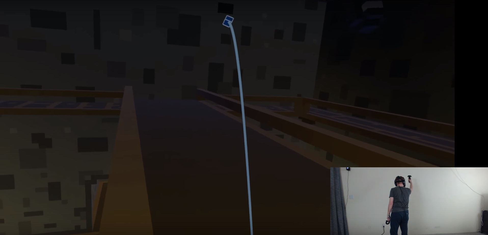

# Onderzoek VR

## Desk Research

### So what about storytelling in VR?

#### AR/VR and the Future of Storytelling with Future Lighthouse Founder Nicolás Alcalá \| Singularity Hub \(2017\)

{% embed data="{\"url\":\"https://www.youtube.com/watch?v=kXJHYJbRMqU\",\"type\":\"video\",\"title\":\"AR/VR and the Future of Storytelling with Future Lighthouse Founder Nicolás Alcalá \| Singularity Hub\",\"description\":\"In an interview with Pascal Finette at SU’s Global Summit in San Francisco, Nicolás Alcalá dived into the future of immersive filmmaking and storytelling. Alcalá is CEO and founder of Future Lighthouse, a virtual reality studio based in Los Angeles and Spain.\\n\\nHe believes movies and video games will come together in the future to form a new medium of expression that\'s interactive, immersive, and adaptive.\\n\\n\\\"I don\'t think we\'re going to call them movies. I think there are going to be experiences that are more and less interactive. So, it\'s going to be movies and video games and everything in-between,\\\" Alcalá said. \\\"VR is a new language, not a new technology but a new language, something that will teach us new words to understand new reality.\\\"\\n\\nEventually, we\'ll move beyond today\'s clunky wired headsets, AR and VR will merge, and CGI will become photorealistic. From there? It\'s up to us what new worlds we create and stories we tell.\\n\\nSubscribe: http://bit.ly/1Wq6gwm\\n\\nConnect with Singularity University:\\nWebsite: http://su.org\\nHub: http://singularityhub.com\\nFacebook: https://www.facebook.com/singularityu\\nTwitter: https://twitter.com/singularityu\\nLinkedin: https://www.linkedin.com/company/singularity-university\\n\\nAbout Singularity University:\\nSingularity University is a benefit corporation headquartered at NASA’s research campus in Silicon Valley. We provide educational programs, innovative partnerships and a startup accelerator to help individuals, businesses, institutions, investors, NGOs and governments understand cutting-edge technologies, and how to utilize these technologies to positively impact billions of people.\\n\\nSingularity University\\nhttp://www.youtube.com/user/SingularityU\",\"icon\":{\"type\":\"icon\",\"url\":\"https://www.youtube.com/yts/img/favicon\_144-vfliLAfaB.png\",\"width\":144,\"height\":144,\"aspectRatio\":1},\"thumbnail\":{\"type\":\"thumbnail\",\"url\":\"https://i.ytimg.com/vi/kXJHYJbRMqU/maxresdefault.jpg\",\"width\":1280,\"height\":720,\"aspectRatio\":0.5625},\"embed\":{\"type\":\"player\",\"url\":\"https://www.youtube.com/embed/kXJHYJbRMqU?rel=0&showinfo=0\",\"html\":\"
<iframe src=\\\"https://www.youtube.com/embed/kXJHYJbRMqU?rel=0&amp;showinfo=0\\\" style=\\\"border: 0; top: 0; left: 0; width: 100%; height: 100%; position: absolute;\\\" allowfullscreen scrolling=\\\"no\\\"></iframe>
\",\"aspectRatio\":1.7778}}" %}

Nicolás Alcalá vertelt hier over de toekomst van storytelling wat VR betreft. Hij denkt dat storytelling door VR gaat veranderen naar een geheel wat sowieso meer interactief is. Hier vertel hij over dat films niet meer zo genoemd gaan worden, maar het geheel meer een ervaring zal worden dan een film. 

Nicolás beweert dat de toekomst van entertainment in VR _Reactive Content_ wordt. Dat is dus content die zich aanpast naar al jouw voorkeuren als persoon \(denk aan Spotify playlist checken, geuren, kleuren, etc\).

Alcalá zegt tijdens een opmerking over de onhandigheid van VR, dat hij de onderscheid tussen VR en AR onzin vindt. Het enige verschil wat hem betreft is hoeveel lagen de gebruiker voor de werkelijkheid zichtbaar heeft. Daarover fantaseert hij, dat de verre toekomst van VR niet ophoudt bij het alleen prikkelen van de zicht en gehoor. Maar dat \(via neural link\) de menselijke perceptie beïnvloedt kan worden om zintuigelijk een VR wereld waar te nemen, zonder de behoefte te hebben voor een bril. 

Als laatste deelt Alcalá dat VR de mogelijkheid biedt om op veel verschillende gebieden educatie te verbeteren. Als argument geeft hij dat het beter is om mensen de situatie te laten ervaren dan vanuit een vaste theoretische wijze te leren. Hierbij moet ik zelf denken aan applied/serious games die dezelfde mogelijkheid al bieden, maar vanuit een 2D setting. 

#### VR: how the future of storytelling will change us \| Julie Krohner \| TEDxCambridgeUniversity \(2017\)

{% embed data="{\"url\":\"https://www.youtube.com/watch?v=OlIlmGjaVec\",\"type\":\"video\",\"title\":\"VR: how the future of storytelling will change us \| Julie Krohner \| TEDxCambridgeUniversity\",\"description\":\"Immersive storytelling \(Virtual Reality\) is not new, but an ancient practice that is now amplified by powerful technology, allowing us to walk in the shoes of another person. Krohner is an ethnographic researcher in emerging tech, social impact and healthcare, exploring how to measure empathy in virtual and mixed reality. This talk was given at a TEDx event using the TED conference format but independently organized by a local community. Learn more at https://www.ted.com/tedx\",\"icon\":{\"type\":\"icon\",\"url\":\"https://www.youtube.com/yts/img/favicon\_144-vfliLAfaB.png\",\"width\":144,\"height\":144,\"aspectRatio\":1},\"thumbnail\":{\"type\":\"thumbnail\",\"url\":\"https://i.ytimg.com/vi/OlIlmGjaVec/maxresdefault.jpg\",\"width\":1280,\"height\":720,\"aspectRatio\":0.5625},\"embed\":{\"type\":\"player\",\"url\":\"https://www.youtube.com/embed/OlIlmGjaVec?rel=0&showinfo=0\",\"html\":\"
<iframe src=\\\"https://www.youtube.com/embed/OlIlmGjaVec?rel=0&amp;showinfo=0\\\" style=\\\"border: 0; top: 0; left: 0; width: 100%; height: 100%; position: absolute;\\\" allowfullscreen scrolling=\\\"no\\\"></iframe>
\",\"aspectRatio\":1.7778}}" %}

VR kan zorgen voor immersive experiences bij mensen zonder daadwerkelijk iets mee te maken. Dit heeft te maken met _presence._ Dit is het verschijnsel waarbij hersenen een virtuele ervaring rekenen als een werkelijke ervaring \(Krohner, 2017\). Krohner stelt de vraag, "Kan een virtuele ervaring empathie opwekken?", waarvoor zij meldt dat het zeker mogelijk is. Dit leidt op zijn tijd weer tot _Immersive Journalism_. Dit concept heeft als inherente eigenschap dat personen mogelijk meer empathie voelen omdat het nieuws meer een ervaring is dan een passieve actie \(Khroner, 2017\). Dus, het concept _presence_ waar Krohner het over heeft. 

Een erg interessante ontwikkeling hierin zijn de VR nieuws platform de gecreëerd zijn. Waar mensen bij elkaar kunnen komen en face-to-face, weliswaar in VR, hierover kunnen praten. Er is een meer menselijke tone-of-voice in de gesprekken in vergelijking met een twitterfeed volgens Krohner. Aan de andere kant denk ik op dat op dit moment, de mensen die daadwerkelijk naar zo'n setting gaan om over het nieuws te praten, daadwerkelijk mensen zijn die geïnteresseerd zijn in kritieke gesprekken. Op het moment dat VR technologie meer beschikbaar wordt, kan dit een heel ander verhaal zijn. Een 4chan raid zou veel mensen perplex laten.

### So, what about locomotion in VR?

#### Locomotion in VR: Overview of different locomotion methods on HTC Vive \(2016\)

{% embed data="{\"url\":\"https://www.youtube.com/watch?v=p0YxzgQG2-E\",\"type\":\"video\",\"title\":\"Locomotion in VR: Overview of different locomotion methods on HTC Vive\",\"description\":\"A demonstration of various different proven and experimental locomotion methods for HTC Vive virtual reality.\\n\\nLocomotion is the method of navigating virtual spaces in VR. There are many types of locomotion in VR right now, with different levels of immersion and potential motion sickness. In this video I try out as many locomotion methods as I could find for the HTC Vive virtual reality HMD. I stuck with locomotion methods that don\'t require any peripherals outside of the HTC Vive motion controllers, so no Virtuix Omni treadmill, flight sticks, racing wheels, or other VR accessories.\\n\\nHere\'s a list of the games and locomotion demos I showed in this video:\\n\\nSpell Fighter VR 0:00\\nVanishing Realms 2:11\\nThe Gallery: Call of the Starseed 2:20\\nSpells \'n\' Stuff 2:45\\nBudget Cuts Demo 3:03\\nCosmic Wandering \(WalkAbout\) 4:08\\nRIPmotion Demo 5:33\\nVR Walking Prototype \(arm swinging\) 6:57\\nHallway 8:22\\nWorld Rotator 9:42\\nSkier 10:33\\nUnseen Diplomacy 11:51\\nVR zGame 13:31\\nPaintey 14:27\\nWindlands 16:32\\nLeave the Nest 18:10\\n\\nSome information about the locomotion demos I played:\\n\\nCosmic Wandering aka WalkAbout:\\nDeveloped by Tekton Games, check out their website:\\nhttp://tektongames.com/\\nDownload the demo here:\\nhttps://punchey.itch.io/cosmic-wandering\\n\\nRIPmotion:\\nDeveloped by Ryan Sullivan, check out his website:\\nhttp://smirkingcat.software\\nDownload the demo here:\\nhttp://smirkingcat.software/ripmotion/\\n\\nVR Walking Prototype\\nDeveloped by David Dewhirst, check out his website:\\nhttp://www.daviddewhirst.co.uk/\\nDownload the demo here:\\nhttps://drive.google.com/file/d/0B8X\_kdjMA6HTYTRsZmNtemQwU2c/view?usp=sharing\\n\\nVR Locomotion Experiments \(Hallway, World Rotator, Skier\)\\nDeveloped by Reddit user qwv4851, see his post here:\\nhttps://www.reddit.com/r/Vive/comments/4kpmbh/vr\_locomotion\_experiments/\\nDownload the demo here:\\nhttps://mega.nz/\#!FNh0yRYT!09rQffP92P6ErUd8tu5BYFpP-gqKfRF1G72ItL0sssM\\n\\nCheck out my channel if you\'re into virtual reality. I put out tons of VR content for the HTC Vive and Oculus Rift CV1 HMDs. Please subscribe if you like what you see!\\n\\nFollow me on Twitch:\\nhttp://www.twitch.tv/obumble\\n\\nFollow me on Twitter:\\nhttp://www.twitter.com/obumble\\n\\nComputer Specs:\\nOS: Windows 10 64bit\\nVideo Card: GeForce GTX 980 Ti 6GB\\nMemory: 32 gigs\\nProcessor: 3.3GHz Intel Core i7-5820K \\nMotherboard: MSI X99S GAMING 9 ACK EATX LGA2011-3\\nVR Hard Drive: Samsung 840 EVO 1TB 2.5\\\" SSD\",\"icon\":{\"type\":\"icon\",\"url\":\"https://www.youtube.com/yts/img/favicon\_144-vfliLAfaB.png\",\"width\":144,\"height\":144,\"aspectRatio\":1},\"thumbnail\":{\"type\":\"thumbnail\",\"url\":\"https://i.ytimg.com/vi/p0YxzgQG2-E/maxresdefault.jpg\",\"width\":1280,\"height\":720,\"aspectRatio\":0.5625},\"embed\":{\"type\":\"player\",\"url\":\"https://www.youtube.com/embed/p0YxzgQG2-E?rel=0&showinfo=0\",\"html\":\"
<iframe src=\\\"https://www.youtube.com/embed/p0YxzgQG2-E?rel=0&amp;showinfo=0\\\" style=\\\"border: 0; top: 0; left: 0; width: 100%; height: 100%; position: absolute;\\\" allowfullscreen scrolling=\\\"no\\\"></iframe>
\",\"aspectRatio\":1.7778}}" %}

Ook al is het stuk mogelijk gedateerd, wordt in deze video een duidelijke uitleg gegeven van de basics van locomotion in VR. Er zijn een aantal manieren om te bewegen in de virtuele wereld:

* Fysieke beweging \(locomotion\)
* Joystick \(virtuele beweging, artificial locomotion\)
* Teleportation 

In het komende stuk gaat voornamelijk teleportation behandeld worden. Fysieke beweging heeft de inherente beperking dat de fysieke ruimte waarin gespeeld wordt, bijna nooit zo groot is als de virtuele wereld waarin gespeeld wordt. Daarnaast bestaat er dus ook _artificial locomotion._ Dit is bewegen door de virtuele wereld met een joystick.Bij veel gebruikers is dit wat de meeste wagenziek maakt. Dit komt omdat er een discrepantie is tussen de verschillende zintuigen die beweging kunnen waarnemen. In dit geval nemen de ogen beweging waar. Maar de halfcirkelvormige kanalen in je oor, doen dit niet \(Saladin & Kenneth, 2012\).

Voor teleportatie zijn er veel verschillende designs die gebruikt worden. Elk design heeft een aantal implicaties die contextueel gebonden zijn aan het spel en de mechanieken die de developers eraan hebben toegevoegd. Ik ga een paar uit de video hier beschrijven. De eerste vorm is hierboven afgebeeld en hoort bij het spel _Spellfighter VR_. Waarbij de speler voor de teleportatie met de controller moet richten waar hij zich naar toe wilt verplaatsen, waarna er een avatar vanaf de speler naar de punt van locatie loopt. Als de avatar zich op de target location bevindt, dan laat de speler de teleportatie knop los, en teleporteert de speler zich. Wanneer de speler de teleportatie keybind loslaat voordat de avatar bij de target location is, dan teleporteert de speler naar de plek van de avatar. 

Het spel Vanishing Realms heeft een vrij bekende design pattern die veel gebruikt is in games. Namelijk de _point-and-click_. Weliswaar de VR variant ervan, maar wat het hierbij wilt zeggen is dat de teleportatie onmiddelijk is. 

Bij _The Gallery_ is er ook een vorm van _point-and-click_ systeem, maar biedt wat meer mogelijkheden aan de speler. Zo kan deze namelijk ook de richting selecteren waarin de frontale kant van de speler naar toe komt te kijken. Dit biedt meer mogelijkheden wat betreft de fysieke beperking die de speler heeft door in wat voor kamer hij aan het spelen is. 

Dit spel heeft een nieuwe dimensie toegevoegd aan locomotion. Voor virtuele beweging moeten spelers een object gooien waar de speler zich naar toe wilt verplaatsen. Wat mij intrigeert aan deze design is hoe de developers het voor elkaar hebben gekregen dat het voor de spelers prettig kan voelen om dit voorwerp te gooien. Het voorwerp mag dus niet te licht zijn in de physics van de game, anders vliegt het overal naar toe en stuitert het een paar keer rond voordat het stil komt te staan. Dit moet denk ik wel zorgen voor een interactieve manier van locomotion. 

In _Budget Cuts_ werkt locomotion enigszins hetzelfde als in _Spells 'n Stuff_. In plaats van het gooien van een voorwerp, schiet de speler deze uit een pistool. Als het voorwerp is geland, opent zich een portal, die de speler een preview geeft van de nieuwe locatie. Dan kan de speler besluiten of hij daadwerkelijk de verplaatsing wilt voltooien of niet. Interessant hoe het werkt, het geeft ook een vorm van macht aan de gebruiker. Ik kan me ook voorstellen dat als de speler gewend is aan deze mechaniek, het veel minder desoriënterend en efficiënter is om met behulp van locomotion jezelf door een map te verplaatsen. 

### So, what about Interfaces in VR?

#### VR Interface Design Manifesto \(2015\).

{% embed data="{\"url\":\"https://www.youtube.com/watch?v=n3b8hZ5NV2E\",\"type\":\"video\",\"title\":\"VR Interface Design Manifesto\",\"description\":\"A declaration of intent for the research and design of user interfaces for ergonomic multitasking in virtual reality, focused primarily on the interaction design of operating systems and browsers. The purpose of this manifesto is to explain intent as well as individual bias, assumptions, and reasons. - Dec 2014\\n\\n\(aka, doing a presentation of my project\'s direction for the university while reading off a computer screen but coming off cringily smug because I didn\'t know how to act natural\)\\n\\nPresented by MikeAlger at Ravensbourne in London.\\nmikealger.com/professional\\n\\nFollowup video: https://www.youtube.com/watch?v=id86HeV-Vb8\",\"icon\":{\"type\":\"icon\",\"url\":\"https://www.youtube.com/yts/img/favicon\_144-vfliLAfaB.png\",\"width\":144,\"height\":144,\"aspectRatio\":1},\"thumbnail\":{\"type\":\"thumbnail\",\"url\":\"https://i.ytimg.com/vi/n3b8hZ5NV2E/maxresdefault.jpg\",\"width\":1280,\"height\":720,\"aspectRatio\":0.5625},\"embed\":{\"type\":\"player\",\"url\":\"https://www.youtube.com/embed/n3b8hZ5NV2E?rel=0&showinfo=0\",\"html\":\"
<iframe src=\\\"https://www.youtube.com/embed/n3b8hZ5NV2E?rel=0&amp;showinfo=0\\\" style=\\\"border: 0; top: 0; left: 0; width: 100%; height: 100%; position: absolute;\\\" allowfullscreen scrolling=\\\"no\\\"></iframe>
\",\"aspectRatio\":1.7778}}" %}

## Field Research

### VR Lab

Op 14 September werd een gedeelte van de media lounge omgetoverd tot VR lab zodat er onderzoek verricht kon worden aan de hand van de opgestelde onderzoeksvragen. De resultaten staat in de bijlage uitgeschreven. Een samengevatte versie van de resultaten is hieronder beschreven. 

### Onderzoeksvragen

* **Wat zijn voorkomende vormen van teleportation in VR games?** 

In de desk research ben ik veel verschillende vormen van teleportation tegengekomen die gebruikt worden in VR games. Sommige vormen wat meer onmiddellijk dan anderen. Van de VR experiences die ik geprobeerd heb, had geen één teleportatie. Verder zag ik alleen dat Robo Recall teleportatie had. Dat was dan één van de mechanieken die ik heb beschreven, waarbij de speler een voorwerp afschiet, de plek waar dit voorwerp dan terecht komt, kan de speler naar toe teleporteren. De speler kan overigens ook zijn oriëntatie kiezen op dat punt van interesse. 

* **Ervaar ik veel verschil in motion sickness met de verschillende vormen van locomotion in de beschikbare VR games?**

Ik ben erachter gekomen dat ik ongelooflijk gevoelig ben voor wagenziekte in VR games. Alles waar kunstmatige locomotion in plaats vindt, word ik ontzettend duizelig van. Ik heb geen ervaring gehad met teleportatie.  De Playstation VR en Space Battle hebben me behoorlijk toegetakeld. 

* **Wordt er rekening gehouden met de grootte van de fysieke ruimtes in VR games?** 

Zo lang de platform niet werkt met iets als de _lighthouses_ van HTC Vive, dan is dit dus niet het geval. Bij het Oculus Dreamdeck kon je bewegen door de virtuele wereld door rond te lopen in de fysieke wereld. Ik had, door fysieke beperkingen van de ruimte, niet de mogelijkheid om veel te bewegen. Ik ben erg benieuwd naar wat er dan gebeurd. Waarschijnlijk is het niet bijzonder en kan de oculus niet goed worden afgelezen. 

* **Welke VR voelt prettig voor gebruik?**

Dit is dus nogal arbitrair om te zeggen over een VR platform. Toch kan ik het enigszins beschrijven. Ik merk aan de VR Gear dat de resolutie wat lager ligt dan bij platformen waarbij de berekeningen op een desktop worden gedaan. Voor mijn gevoel is de resolutie van de schermen in dergelijke VR brillen veel hoger, daarnaast heeft een desktop meer rekenkracht \(over het algemeen\) dan een S9. Verder weet ik niet precies waar het aan lag, maar de Playstation VR zorgde ervoor dat ik ontzettend misselijk werd. Roey vertelde dat hij hetzelfde ervaart met de Playstation VR. Misschien lag het aan de kunstmatige locomotion door middel van de joystick. Ik zou verder moeten onderzoeken of er nog andere factoren een rol spelen \(framerate, resolutie\).

* **Wat is de viewport van de beschikbare AR in CMD?**

De viewport van de Hololens is relatief gezien klein. Vooral in vergelijking met VR brillen die zowel de centrale als de perifere zichtveld stimuleren. Echter ben ik niet van mening dat dit iets is wat schadelijk is voor het gebruik van de hololens. De content die op de hololens beschikbaar is, is content waar aandacht op gevestigd moet worden. Dit zorgt er voor dat wanneer dit soort content in de perifere zicht getoond zou worden, het onleesbaar of onopvallend zou zijn. 

* **Wat is de kwaliteit van het beeld van AR?**

De kwaliteit van het beeld is bijzonder goed. Dit vond ik moeilijk om me voor te stellen, aangezien het een projectie is boven de lichtreflectie die de ogen van de gebruiker binnen komt. Er wordt wel gebruik gemaakt van specifieke kleuren. Ik weet niet of dit specifiek het geval is bij de Microsoft Hololens. Ik kan me ook voorstellen dat sommige kleuren vrij moeilijk zijn om helder te krijgen \(geel is meestal zo'n kleur\). 

### Conclusie

Samenvattend was de VR lab een leuke ervaring. Ik ben erachter gekomen waar ik wel en niet tegen kan. Het was voor mij vrij snel duidelijk dat heftige actie games waar er kunstmatige locomotion in plaats vindt een grote no-go zijn voor mij. Maar games waarbij je wat meer stil zit, sociale interactie hebt \(en moet puzzelen\) veel immersie creëren voor me. Dit was het geval bij Star Trek Bridge Crew. 

Ik zou me graag meer met locomotion en teleportatie willen bezig houden. Dit zou ik dan willen doen om actie of FPS games meer toegankelijk te maken voor iedereen en dus ook mensen die veel last hebben van motion sickness. Zoals te zien is bij de desk research heb ik al vrij veel onderzoek gedaan naar locomotion en teleportation in verschillende games. Een uitdaging van dit onderwerp is dat het erg context afhankelijk is wanneer een vorm van teleportatie juist kan aanvoelen voor een game of niet. Als de vorm van beweging niet past bij de game, kan dat de speler volledig uit immersie halen van een game en de rest van de game te min doen.  

Wat betreft AR, zou ik graag meer field research doen om te kunnen ervaren wat de toevoegingen zijn van AR in het dagelijks leven of in het werkleven. Daarnaast was ik aangenaam verrast door de kwaliteit van het beeld dat zichtbaar is, ook al is de viewport relatief klein. 

## Concepten

### Locomotion in VR Games

Aangezien ik zo veel last van wagenziekte had tijdens het spelen van de VR games, zag ik een mogelijke uitdaging om hier een verandering in te brengen. Het eerste idee wat in mij op kwam, was om een kleine manifesto te maken voor welke soort locomotion meer gepast zijn bij specifieke genre games. Hierbij kijkend naar hoe specifieke locomotion, mogelijke contextuele factoren uit de game in staat stellen om te excelleren. Daarbij bedacht ik me ook dat dit te veel werk is voor de twee weken die nog over zijn voor dit vak. Dus, koos ik om het locomotion concept te vernauwen. Ik wil graag een manier van locomotion of teleportatie vinden die ansich engageert met de speler. Om een voorbeeld te geven, tijdens de VR lab hoorde ik van klasgenoten dat ze Robo Recall leuk vonden, maar dat de manier van teleportation de snelheid van het spel verstoorde. Ik wil graag een nieuwe vorm van locomotion bedenken die hier mogelijk verandering aan gaat brengen. 

### Healthbars & Immersion 

Één van de challenges die beschikbaar is vanuit de sheets van het vak VR is: _"How can you show a user's health without breaking immersion?" ._ Deze challenge doet gelijk mijn creativiteit barsten. Want er zijn gigantisch veel verschillende manieren om dit aan te pakken. Daarnaast is het dus ook erg afhankelijk van de game. In het geval de game een sci-fi shooter is, is het niet zo gek bijvoorbeeld om de actor van de speler een helm te geven waar mogelijk een UI de health statistics van de speler laat zien. Hetzelfde principe zou je kunnen doen met behulp van een horloge die dezelfde informatie zou kunnen tonen. Dit wordt dan ook gedaan in het spel _Arizona Sunshine._ 

###  Review Concepten

Na dat ik het concept van teleportation had gekozen, ben ik nog een keer naar Robo Recall gaan kijken om met een extra kritisch oog de teleportation van het spel te bekijken. Toen ben ik tot de conclusie gekomen dat het een spel is waarbij de locomotion al ontzettend goed werkt. Met behulp van wat advies ben ik de focus meer gaan leggen op hoe ik een efficiënte manier van teleportatie kan ontwerpen, zonder rekening te houden met de context van een spel waar het mogelijk in zou komen.  De volgende fase zal zich focussen op het laatste ontwerp traject. Dus van een idee, tot een design, tot een prototype.  

## Bronnen

Saladin, Kenneth S. \(2012\). _Anatomy and Physiology: The Unity of Form and Function._ New York: McGraw Hill. pp. 607–8. 

Afbeelding 1, 2, 3, 4, 5. Locomotion in VR: Overview of different locomotion methods on HTC Vive. Verkregen op: [https://www.youtube.com/watch?v=p0YxzgQG2-E](https://www.youtube.com/watch?v=p0YxzgQG2-E)

Afbeelding 6. VR Locomotion Tips, 2017 Edition. Verkregen op: [https://guendeli.github.io/blog/VR-Motions/](https://guendeli.github.io/blog/VR-Motions/)

Afbeelding 7. THEY WANT TO EAT ME \| Arizona Sunshine \(HTC Vive Virtual Reality\). Verkregen op: [https://www.youtube.com/watch?v=APW4lDwUseU](https://www.youtube.com/watch?v=APW4lDwUseU)

## Bijlage

### Research Document VR lab \| Oculus Dreamdeck

**Game name:** Oculus Dreamdeck  **Genre:** Movie / Exhibition  **Device:** Oculus

#### Describe your experience shortly

Het was interessant om te kunnen kijken zonder iets te hoeven doen. In zekere zin een soort film ervaring. Ook prettig dat je een vaste punt hebt en er geen kunstmatige locomotion was. Ik kon bewegen door midden van fysieke locomotion, de beweging in de virtuele wereld was beperkt. Dit ervaarde ik niet als een negatief punt. 

#### Is VR Adding value to the overall experience?

Voor mijn gevoel wel, je kan immers overal naar toe kijken waar je wilt. Vooral bij het stuk in 'Arkham City'. Het was mogelijk om over de gevel te kijken van het gebouw, dit had dan ook best wel een impact op me. 

#### Is the game immersive?

Naar mijn gevoel wel. Zoals ik net beschreef, zorgde het ervoor dat ik fysieke reacties had op de game en dan op een positieve manier. Ik weet niet of het bewust was, maar de point-of-view van de speler zat best wel laag, volgens mij om te benadrukken dat je een klein dier was. Dat voegde een extra dimensie aan de ervaring. 

#### What makes the game unique?

Als ik het vergelijk met alle andere games die beschikbaar waren tijdens de VR lab, was die uniek omdat het de enige 'game' was waar de speler niet pro-actief aan de slag hoefde te gaan. Het was mogelijk om de tentoonstelling simpelweg te ervaren en om je heen te kijken. Dat was een prettige verandering in tempo in vergelijking met de meeste andere games. 

#### How is information presented to you?

De content was vooral in de vorm van visuals en geluid. Daarnaast kon je als speler dus nog beperkt rond lopen binnen de ruimte. 

#### What tricks and techniques are used to draw your attention to things around you?

Beweging werd veel gebruikt om de aandacht van de speler te trekken. Ook werd je als speler altijd in de richting geplaatst van waar de aandacht aan gegeven moest worden. Daarbij ook sound queues gebootst werden alsof ze van een specifieke kan van kwamen. 

### Research Document VR lab \| Space Battle

**Game name:** Space Battle **Genre:** Game **Device:** Gear VR

#### Describe your experience shortly

Het was een nare ervaring. Ik heb hierdoor de rest van de dag hoofdpijn gehad. Je wordt de werekd ub gelanceerd in een ruimteschip, zonder enige controle. Gigantisch veel visual cues en geluid, het was daadwerkelijk misselijkmakend. 

#### Is VR Adding value to the overall experience?

Nee, zeker niet. In tegendeel zelfs, het was de ervaring te min aan het doen. Dit had een leuke arcade game kunnen zijn. 

#### Is the game immersive?

Nou, in zekere zin wel. Het ruimteschip gaat over de kop, daarnaast is het spel erg snel. Ik had zeker het gevoel dat ik in een snelle ruimteschip zat, maar daar horen dan ook vervelende gevoelens bij, zoals wagenziekte. 

#### What makes the game unique?

Voor mijn gevoel is er niet echt iets wat het uniek maakt. VR games zijn wel vaker arcade-achtige games. 

#### How is information presented to you?

Visual cues en geluiden. Op de enemies was er een lock-on functie zodat het schieten iets makkelijk was. 

#### What tricks and techniques are used to draw your attention to things around you?

Beweging en geluid. 

### Research Document VR lab \| Star Trek Bridge Crew

**Game name:** Star Trek ****Bridge Crew **Genre:** Game **Device:** Oculus Rift

#### Describe your experience shortly

Het is een game waarbij in co-op vier verschillende spelers een ruimteschip moeten besturen om zo doelen te behalen. Het spel was erg vermakelijk door de extra dimensies die VR toevoegt aan het spel. 

#### Is VR Adding value to the overall experience?

Ja, zeker weten! VR voegt er een extra sociale dimensie toe aan het spel. Je kan namelijk aan de hand van de gebaren van andere spelers zien hoe zij het spel ervaren. Het is erg makkelijk om geërgerde gebaren te zien. Daarnaast, krijg je als speler na een tijd in de game, het gevoel dat je daadwerkelijk in een ruimteschip zit. Ik had vrij weinig last van wagenziekte, maar dat komt denk ik doordat het schip waar de spelers zich in bevinden vrij groot is. Dit zorgt ervoor dat je duidelijke oriëntatiepunten hebt, wat op weer leidt tot minder wagenziekte. 

#### Is the game immersive?

Zoals ik net al zei, na een tijd het spel spelen, zit je voor je gevoel echt in het ruimteschip. Je weet dan welke speler wie is in het spel, onafhankelijk van wat de fysieke positie is van de spelers. 

#### What makes the game unique?

Het is een rustig spel. Dat was een vrij groot verschil met de meeste andere games die beschikbaar waren in de VR lab. Daarnaast was de incentive voor coöperatie een leuk spel element. 

#### How is information presented to you?

Veel van de informatie waar je het mee moet doen als speler komt uit een in-game UI. Elke speler heeft een ander scherm waar hij/zij informatie uit kan halen. Daarnaast zijn er ook veel geluiden die de aandacht trekken. 

#### What tricks and techniques are used to draw your attention to things around you?

Nou, als kapitein werd je aandacht getrokken naar wat er buiten het schip gebeurde. Op deze manier kon je zien waar je naar toe ging. Het andere grote aandachtspunt waren de knoppen die zichtbaar waren op het uiteinde van je armleuningen. Hiermee kon je de verschillende facetten openen van de UI die er voor de kapitein waren. 

### Research Document VR lab \| Microsoft Hololens

**Game name:** - **Genre:** Tool **Device:** Microsoft Hololens

#### Describe your experience shortly

Dit was erg interessant. Ik was erg benieuwd naar hoe überhaupt de projectie plaats vond. Na wat verdere inspectie had ik door dat er geprojecteerd word op de glazen in de hololens. Ik neem aan dat dit vanaf de bovenkant van het glas wordt gedaan en dat er gebruikt wordt gemaakt van hoe licht breekt door glas om de projectie op bepaalde plekken vast te zetten. Ik vond dit erg indrukwekkend. Er wordt gebruikt gemaakt van een vaste lijn, die ongeveer ter hoogte van de 'horizon' zit. Hier kan je alle informatie in vinden die de bril beschikbaar maakt. Daarnaast werd het klik mechanisme erg goed. Het is helemaal niet nodig om de klikhand ter hoogte van de bril te houden. 

#### Is AR Adding value to the overall experience?

Jammer genoeg kon ik de bruikbaarheid van de hololens niet echt testen, omdat die niet verbond aan het wifi netwerk. Ik zou graag willen zien wat voor tools je kan gebruiken en wat voor toevoeging het zou kunnen hebben aan het dagelijkse leven. 

#### Is the game immersive?

Ik weet niet zo het zozeer immersive is. Daardoor zou ik dus graag de bruikbaarheid van de tools willen zien. Ik kan me voorstellen dat het mogelijk een toevoeging kan zijn voor zaken op werk. 

#### What makes the game unique?

Ik heb zelf nog nooit AR gebruikt zien worden. In die zin was het uniek voor mij. 

#### How is information presented to you?

De beschikbare content is te zien als een projectie over de werkelijkheid. Daarnaast zijn er sound cues die feedback geven of je een actie hebt ondernomen. 

#### What tricks and techniques are used to draw your attention to things around you?

De 'base lijn' die gebruikt wordt trekt je aandacht naar het horizon. Zo kan je als gebruiker dus zien waar je nou naar moet kijken. 

### Research Document VR lab \| Playstation VR

**Game name:** Shooter **Genre:** Game **Device:** Playstation VR

#### Describe your experience shortly

Dit was een vrij rampzalige ervaring ook. Om de een of ander reden was alle locomotion in de game alleen voorwaarts of achterwaarts. Daarnaast werd ik ontzettend misselijk van de artificial locomotion door middel van de joystick. 

#### Is VR Adding value to the overall experience?

Voor mijn gevoel niet. Het had een prima FPS kunnen zijn. De schiet mechaniek werkte vrij goed. Het ADS was leuk om te testen en was ook accuraat. Maar de locomotion verpestte de game voor me. 

#### Is the game immersive?

Dit is lastig. Aan de ene kant dus niet, door de beweging. Dit zorgde voor barstende koppijn. Aan de andere kant, als zo'n kleine spin op je springt, schrik je behoorlijk goed. Het voelt dus heel reëel. 

#### What makes the game unique?

De schiet mechaniek, met het fysieke wapen dat je gebruikt voor het schieten was leuk, maar ook een beetje gimmicky. 

#### How is information presented to you?

Visual cues en sound.

#### What tricks and techniques are used to draw your attention to things around you?

Er werd veel gebruik gemaakt van visuele contrast in kleuren en grootte om duidelijk te maken dat er levende actors waren die de target van de speler waren. Natuurlijk kwam hier ook de nodige geluid cues bij kijken. 

